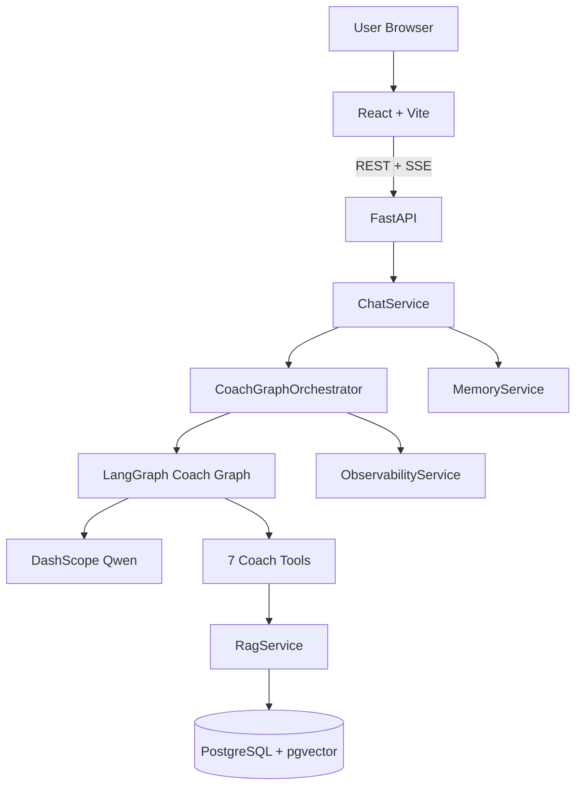

# Fitness Coach Agent

> 多运动健康 Multi-Agent Coach — LangGraph · Hybrid RAG · Graph RAG · SSE  
> Multi-agent sports-health coach powered by LangGraph, RAG (pgvector), and DashScope Qwen.



## Highlights

| # | 亮点 | One-liner |
|---|------|-----------|
| 1 | Multi-Agent 并行 | LangGraph `Send` 并行 training/nutrition sub-agent，recovery 自动合并 |
| 2 | Planning + CoT | `plan_execute` 结构化 JSON plan；sub_agent ReAct + CoT 入库 |
| 3 | Hybrid RAG | 向量 + 关键词 RRF 融合，score threshold 过滤 |
| 4 | Graph RAG | PostgreSQL 实体关系表，`graph_lookup` 补充向量检索 |
| 5 | 职责分离 | ChatService 管消息/`done`；Orchestrator 管 agent_run，图内不写 chat_messages |
| 6 | SSE 契约 | synthesize 透传 `replace`；多 agent 合并 `delta` 流式 |
| 7 | Benchmark | 81 条标注样本，faithfulness 评测 + admin 仪表盘 |
| 8 | Observability | agent_run / agent_steps / llm_calls 全链路 timeline |

深入学习与面试准备 → **[docs/INDEX.md](docs/INDEX.md)**

## Quick start

### 1. Database (Docker)

```bash
docker compose up -d
```

Starts PostgreSQL 16 + pgvector on `localhost:5432` (database `fitness_coach`).

### 2. Backend

```bash
cd backend
python -m venv .venv
.venv\Scripts\activate          # Windows
# source .venv/bin/activate     # macOS/Linux
pip install -r requirements.txt
copy .env.example .env          # cp on Unix
```

Set in `backend/.env`:

- `DASHSCOPE_API_KEY` — required for chat, embedding, and agent
- `AUTH_SECRET_KEY` — min 32 chars (auto-validated in production)

Full env reference: [docs/reference/CONFIG.md](docs/reference/CONFIG.md)

Run migrations (first time):

```bash
alembic upgrade head
```

Start API:

```bash
uvicorn app.main:app --reload --host 0.0.0.0 --port 8000
```

OpenAPI: http://localhost:8000/docs

### 3. Frontend

> **Package manager:** this repo uses **pnpm only** (`preinstall` blocks npm/yarn). Install from repo root:

```bash
pnpm install
pnpm --dir frontend run dev
```

App: http://localhost:5173

### 4. Demo accounts

In `APP_ENV=dev` or `test`, startup seeds demo users, knowledge (5 md files), and graph entities. Password for all: **`Demo@123456`**

| Username | Role | Capabilities |
|----------|------|--------------|
| `coach_demo` | user | Chat, profile, feedback |
| `kb_demo` | kb_editor | + knowledge upload/reindex |
| `admin_demo` | admin | + users, observability, benchmark |

Manual seed:

```bash
cd backend
python scripts/seed_demo_data.py
python scripts/seed_demo_data.py --users-only
python scripts/seed_demo_data.py --knowledge-only
```

## Verification

```bash
cd backend && pytest -q
pnpm --dir frontend run lint && pnpm --dir frontend run build
```

Load test (optional, requires [k6](https://k6.io)):

```bash
k6 run scripts/load/chat_stream.js -e BASE_URL=http://localhost:8000 -e TOKEN=<jwt>
```

## 文档 / Documentation

| 我想… | 从这里开始 |
|-------|-----------|
| 30 分钟搞懂项目 | [guide/01](docs/guide/01-项目概览与边界.md) → [03](docs/guide/03-系统架构与分层.md) → [04](docs/guide/04-Agent编排深度解析.md) |
| 搞懂 Agent 编排 | [guide/04-Agent编排深度解析.md](docs/guide/04-Agent编排深度解析.md) |
| 搞懂 RAG | [guide/05-RAG与Graph-RAG.md](docs/guide/05-RAG与Graph-RAG.md) |
| 面试突击 | [interview/FAQ.md](docs/interview/FAQ.md) + [PITCH-5min.md](docs/interview/PITCH-5min.md) |
| 查 SSE 契约 | [reference/AGENT_SSE.md](docs/reference/AGENT_SSE.md) |
| 查 env 配置 | [reference/CONFIG.md](docs/reference/CONFIG.md) |
| 关键决策 ADR | [decisions/INDEX.md](docs/decisions/INDEX.md) |
| 原始设计规格 | [specs/COACH_AGENT_REDESIGN.md](docs/specs/COACH_AGENT_REDESIGN.md) |

### Reference docs

| Doc | Purpose |
|-----|---------|
| [docs/ARCHITECTURE.md](docs/ARCHITECTURE.md) | 架构速查（→ reference/） |
| [reference/AGENT_SSE.md](docs/reference/AGENT_SSE.md) | SSE event contract |
| [reference/LLM_ARCHITECTURE.md](docs/reference/LLM_ARCHITECTURE.md) | Transformer, RAG, long context |
| [reference/COACH_ACCEPTANCE.md](docs/reference/COACH_ACCEPTANCE.md) | Release checklist |
| [reference/COACH_HA.md](docs/reference/COACH_HA.md) | HA notes + k6 |
| [reference/LLM_FINETUNE_EXPERIMENT.md](docs/reference/LLM_FINETUNE_EXPERIMENT.md) | LoRA dry-run pipeline |

## Core features

- **Multi-agent graph**: intent routing → planning → parallel sub-agents → synthesize → [guide/04](docs/guide/04-Agent编排深度解析.md)
- **7 coach tools**: knowledge search, contraindication, profile, macros, training log, alternatives, graph lookup → [guide/07](docs/guide/07-工具系统详解.md)
- **RAG + Graph RAG**: hybrid vector + keyword retrieval → [guide/05](docs/guide/05-RAG与Graph-RAG.md)
- **Memory**: sliding window + session summary (`LONG_CONTEXT_MODE=summary|full`) → [guide/06](docs/guide/06-记忆与长上下文.md)
- **Benchmark**: 81 labeled samples, async runner, admin dashboard → [guide/09](docs/guide/09-评测与观测.md)
- **Observability**: agent run timeline, metrics summary → [guide/09](docs/guide/09-评测与观测.md)

No handoff / ticket / customer-service modules in this repo.

---

## 附录：简历项目描述（≤200 字）

LangGraph 多运动健康 Coach：并行 training/nutrition 子 Agent、Planning+CoT、RAG/Graph RAG 与 7 工具；FastAPI+pgvector+React SSE；含 benchmark 评测、观测与 LoRA 实验脚本。默认 DashScope API，LoRA 仅本地可选。

**面试关键词**：LangGraph · Multi-Agent · Planning · CoT · Hybrid RAG · Graph RAG · pgvector · SSE · Benchmark
