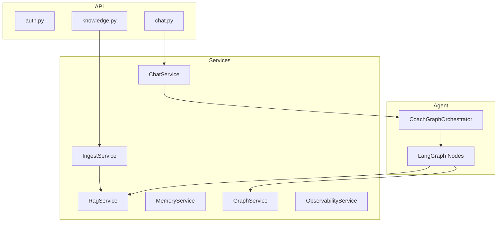
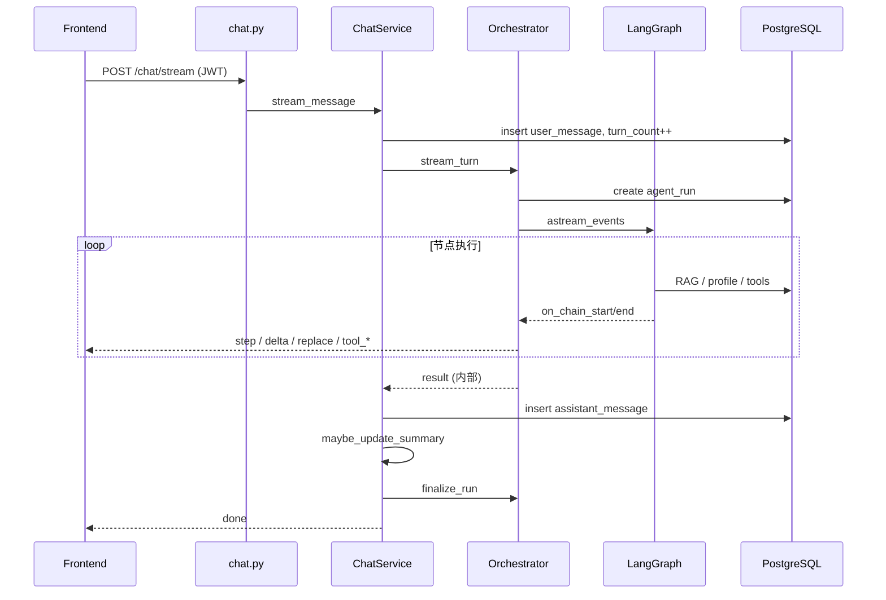

# 03 · 系统架构与分层

| 元信息 | 内容 |
|--------|------|
| **预计阅读** | 15 分钟 |
| **前置知识** | [01-项目概览与边界](./01-项目概览与边界.md)、REST/SSE |
| **相关 ADR** | [COACH_AGENT_REDESIGN](../specs/COACH_AGENT_REDESIGN.md) §3 |

---

## 本节你将学到

- 前后端六层职责与依赖方向
- 一次聊天请求的端到端数据流
- RBAC 如何映射到 API 与 UI
- 异步后台任务（202 + BackgroundTasks）边界
- Observability 与 Benchmark 在架构中的位置

---

## 1. 总体拓扑

```text
┌─────────────────────────────────────────────────────────────┐
│                     Frontend (React + Vite)                  │
│  Contexts → Hooks → Pages → Components → API Layer          │
└───────────────────────────────┬─────────────────────────────┘
                                │ REST + SSE (JWT)
┌───────────────────────────────▼─────────────────────────────┐
│                   Backend (FastAPI + async SQLAlchemy)       │
│  API → Services → Agent(coach/) + Tools → LLM → Auth         │
└───────────────────────────────┬─────────────────────────────┘
                                │
                    ┌───────────▼───────────┐
                    │ PostgreSQL + pgvector │
                    │ graph_entities/edges    │
                    └───────────────────────┘
```

**依赖规则**：API 层只调 Service；Agent 节点通过 `RunnableConfig.configurable` 注入 `db`、`llm`、`rag_service` 等，不直接 import API。

---

## 2. 后端分层详解

| 层级 | 目录 | 职责 | 典型类 |
|------|------|------|--------|
| 入口 | `app/main.py` | lifespan seed、CORS、路由挂载 | FastAPI app |
| API | `app/api/` | HTTP 契约、权限装饰器 | `chat.py`, `knowledge.py` |
| Schemas | `app/schemas/` | Pydantic 请求/响应 | `chat.py`, `benchmark.py` |
| Services | `app/services/` | 业务逻辑、事务边界 | `ChatService`, `RagService`, `MemoryService` |
| Agent | `app/agent/coach/` | LangGraph 图与节点 | `graph.py`, `orchestrator.py` |
| Tools | `app/agent/tools/` | 7 个 Coach 工具 + registry | `KnowledgeSearchTool` |
| Auth | `app/auth/` | JWT、RBAC | `permissions.py` |
| LLM | `app/llm/` | DashScope 封装 | `dashscope_client.py` |
| DB | `app/db/` | ORM models、seed | `models.py`, `seed_graph.py` |
| Core | `app/core/` | 配置、错误、trace | `config.py`, `deps.py` |



---

## 3. 前端分层详解

| 层级 | 目录 | 职责 |
|------|------|------|
| 入口 | `src/main.tsx`, `App.tsx` | Provider 挂载 |
| 上下文 | `src/contexts/AppContext.tsx` | 认证、全局错误 |
| 钩子 | `src/hooks/` | `useSessions`, `useKnowledge`, `useUsers` |
| 页面 | `src/pages/` | Chat、Profile、Knowledge、AgentRuns、Benchmark、Users |
| 布局 | `src/components/layout/Sidebar.tsx` | RBAC 菜单 |
| 聊天组件 | `src/components/chat/` | `ChatWindow`, `AgentStepsPanel`, SSE delta/replace |
| API | `src/api/` | HTTP + SSE 流解析 |
| 样式 | `src/styles/` | CSS 变量设计系统 |

### 聊天 UI 数据流

```text
ChatInput
  → useSessions.sendMessage()
  → api/chat.streamMessage()  [SSE: run | step | tool_* | delta | replace | session | done]
  → ChatWindow / AgentStepsPanel / MessageBubble
```

**契约要点**：`done` **仅在** assistant 消息入库并 `finalize_run` 后发出（见 AGENT_SSE）。

---

## 4. 核心请求链路：流式聊天



### ChatService 三阶段

1. **回合前**：`_get_or_create_session` → `_persist_user_message` → commit  
2. **编排期**：`orchestrator.stream_turn`，转发 SSE，**吞掉** `type=result`  
3. **回合后**：`_complete_turn_events` → 写 assistant → 摘要 → `finalize_run` → `done`

---

## 5. 知识库与 Graph 子系统

```text
上传/seed
  → ingest_service（分块 800/重叠 120 + embedding）
  → knowledge_chunks (vector)

提问
  → knowledge_search / rag_service（混合检索）
  → graph_service.enrich_from_rag（可选 1-hop）
  → 注入 build_llm_messages context_block
  → citations 经 apply_guardrails 写入 state
```

Graph 数据：`seed_graph.py` 预置 exercise/injury/nutrient 实体与边；`GraphEntityLink` 在检索时动态关联 chunk。

---

## 6. Observability 与 Benchmark

| 模块 | 路径 | 作用 |
|------|------|------|
| Observability | `observability_service.py` | `agent_runs`、`agent_steps`、`llm_calls` |
| Admin UI | `AgentRunsPage.tsx` | Run 时间线 |
| Benchmark | `benchmark_runner.py` | 异步跑 `coach_eval.jsonl` |
| Dashboard | `BenchmarkDashboardPage.tsx` |  faithfulness / latency 指标 |

Benchmark 通过 `ChatService.send_message` 走**完整链路**，保证评测与线上一致。

---

## 7. RBAC 权限模型

| 角色 | API/UI 能力 |
|------|-------------|
| `user` | 聊天、本人会话、profile、feedback |
| `kb_editor` | + knowledge upload/reindex |
| `admin` | + users、observability、benchmark |

权限检查：`require_permissions` 依赖注入于 `app/api/*.py`；前端 `Sidebar` 按角色隐藏菜单。

---

## 8. 异步任务边界

| 接口 | 模式 | 后台 |
|------|------|------|
| `POST /knowledge/upload` | 202 | BackgroundTasks 分块索引 |
| `POST /knowledge/documents/{id}/reindex` | 202 | 重建向量 |
| `POST /benchmark/runs` | 202 | 评测集跑分 |

当前用 FastAPI `BackgroundTasks`，**单进程**内有效；多 worker 需 Celery 等（COACH_HA 有说明）。

---

## 9. 横切关注点

|  concern | 实现 |
|----------|------|
| Trace | `core/trace.py` → `X-Trace-Id` |
| 错误对外 | `PUBLIC_ERROR_MESSAGE`，内部 log exception |
| Rate limit | 内存 key 上限 `rate_limit_max_keys` |
| CORS | `settings.cors_origin_list()` |

---

## 代码锚点表

| 路径 | 职责 |
|------|------|
| `backend/app/main.py` | 应用入口 |
| `backend/app/api/chat.py` | 聊天 HTTP/SSE |
| `backend/app/services/chat_service.py` | 聊天业务编排 |
| `backend/app/services/observability_service.py` | Run/Step 持久化 |
| `backend/app/db/models.py` | 全表 ORM |
| `backend/app/core/deps.py` | DB session、LLM 单例 |
| `frontend/src/router.tsx` | 路由表 |
| `frontend/src/hooks/useSessions.ts` | SSE 会话逻辑 |
| `frontend/src/components/chat/AgentStepsPanel.tsx` | Agent 步骤 UI |
| `frontend/src/contexts/AppContext.tsx` | 认证上下文 |

---

## 常见追问

### Q1：为什么 Agent 不直接放在 API 层？

**答**：Service 层复用于 Benchmark、测试；API 只处理 HTTP 语义（status code、StreamingResponse）。

**追问链**：
- *追问*：`get_chat_service` 怎么注入？→ `deps.py` 构造 `DashScopeClient` + `RagService` + `ChatService`。

### Q2：SSE 谁产生、谁转发？

**答**：Orchestrator 通过 `emit` 回调产 step/delta/replace；ChatService 原样 yield；`done` 仅 ChatService 产。

### Q3：事务边界在哪？

**答**：user_message 先 commit；graph 执行中多次 flush；assistant + finalize 再 commit。失败时 run 标记 failed。

### Q4：Graph 和 RAG 谁主谁辅？

**答**：RAG 主检索；Graph 在 prefetch 或 `graph_lookup` 工具中做 1-hop 补充，不替代向量检索。

### Q5：多 worker 部署 SSE 问题？

**答**：长连接需 sticky session；否则 stream 可能断（见 COACH_HA）。

### Q6：测试如何分层？

**答**：`test_rag`/`test_memory` 测 Service；`test_coach_graph` 测图路由；`test_chat_stream` 集成 ChatService+Orchestrator。

### Q7：前端如何处理 replace vs delta？

**答**：synthesize 多 agent 用 delta 流式；单 agent/chitchat/guardrails 用 replace 整段替换。

---

## 延伸阅读

- [ARCHITECTURE](../reference/ARCHITECTURE.md) — 官方架构文档
- [AGENT_SSE](../reference/AGENT_SSE.md) — 事件类型详解
- [COACH_HA](../reference/COACH_HA.md) — 部署注意事项
- [04-Agent编排深度解析](./04-Agent编排深度解析.md) — LangGraph 细节
