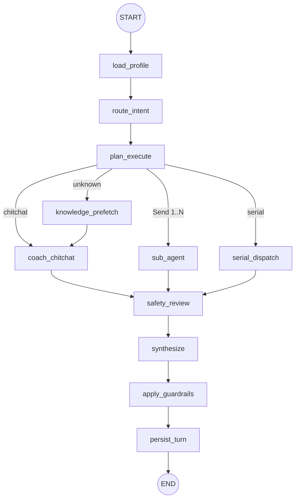

# 04 · Agent 编排深度解析


| 元信息        | 内容                                                                 |
| ---------- | ------------------------------------------------------------------ |
| **预计阅读**   | 45 分钟                                                              |
| **前置知识**   | [03-系统架构与分层](./03-系统架构与分层.md)、LangGraph 基础                         |
| **相关 ADR** | [COACH_AGENT_REDESIGN](../specs/COACH_AGENT_REDESIGN.md) §3.1、§3.6 |


---

## 本节你将学到

- 完整 LangGraph 拓扑与各节点输入输出
- `CoachState` 字段与 `merge_dicts` / `merge_lists` reducer 语义
- `route_after_plan_execute` 条件路由与 `Send` 并行机制
- sub_agent ReAct 工具循环与 SSE 事件
- synthesize 何时 LLM 合并 vs 透传
- safety_review 与 apply_guardrails 双层安全
- Orchestrator 与 ChatService 协作时序（面试高频）

---

## 1. 图拓扑一览

定义于 `backend/app/agent/coach/graph.py`：

```text
START
  → load_profile
  → route_intent
  → plan_execute
  → [条件边 route_after_plan_execute]
        ├─ coach_chitchat      (intent=chitchat)
        ├─ knowledge_prefetch  (intent=unknown)
        │     └─ coach_chitchat
        ├─ sub_agent           (Send：单任务或并行多任务)
        └─ serial_dispatch     (并行关闭且多任务)
  → safety_review
  → synthesize
  → apply_guardrails
  → persist_turn (no-op)
  → END
```




**关键设计**：执行路径在 `plan_execute` 之后分叉；`knowledge_prefetch` 仅服务 `unknown` 意图；所有路径在 `safety_review` 汇合。

---

## 2. CoachState 与 Reducer

`backend/app/agent/coach/state.py`：


| 字段               | 类型              | Reducer         | 含义                              |
| ---------------- | --------------- | --------------- | ------------------------------- |
| `cot_traces`     | `dict[str,str]` | **merge_dicts** | planner/sub_agent/chitchat 推理链  |
| `agent_outputs`  | `dict[str,str]` | **merge_dicts** | 各 agent 最终文本                    |
| `tool_calls`     | `list[dict]`    | **merge_lists** | 工具调用审计                          |
| `rag_citations`  | `list`          | 覆盖              | prefetch + tool 合并后在 guardrails |
| `execution_plan` | `dict`          | 覆盖              | Pydantic `ExecutionPlan` dump   |
| `safety_blocked` | `bool`          | 覆盖              | 安全审查结果                          |
| `final_answer`   | `str`           | 覆盖              | synthesize → guardrails 后答案     |


**并行 sub_agent**：LangGraph `Send` 启动多个 `sub_agent` 实例，各自返回 partial update；reducer **合并** `agent_outputs`、`tool_calls`、`cot_traces`，而非覆盖。

```python
# merge_dicts: {**left, **right}  — 并行 agent 键不冲突（training / nutrition）
# merge_lists: left + right       — 工具调用按时间追加
```

`initial_coach_state()` 在 Orchestrator 构造，注入 `session_id`、`user_message`、`run_id`、`use_rag`。

### 2.1 Reducer 为何能支撑 Send 并行

LangGraph 在节点返回 partial update 时，对 `Annotated[..., reducer]` 字段调用 reducer，而非简单覆盖。本项目三个 reducer 字段的语义：

| 字段 | Reducer | 并行 sub_agent 写入 | 合并结果 |
|------|---------|---------------------|----------|
| `agent_outputs` | `merge_dicts` | `{training: "..."}` / `{nutrition: "..."}` | 两键共存 |
| `tool_calls` | `merge_lists` | 各 agent 的工具审计 | 按时间追加 |
| `cot_traces` | `merge_dicts` | 各 agent 的 CoT | 键为 agent_key |

**键不冲突的前提**：`PlanTask.agent` 经 Pydantic 校验必须在 `active_agents` 内，且 planner 不会为同一 agent 派两个 task。若违反，后写覆盖先写（`{**left, **right}`），测试用 `test_coach_graph.py` 约束路由。

**非 reducer 字段在并行时的行为**：`rag_citations`、`graph_context` 等无 Annotated reducer 的字段，LangGraph 默认 **last-write-wins**。`unknown` 路径下由 `knowledge_prefetch` 预先写入 citations/graph；`sub_agent` 路径的 citations 主要在 `apply_guardrails` 阶段从 `tool_calls` 合并，而非依赖并行节点写 `rag_citations`。

### 2.2 Send 条件路由的决策树

`route_after_plan_execute` 本质是 **纯函数**（无副作用除 `run_meta`），输入 `(state, config)` 输出下一节点名或 `Send` 列表：

```text
intent == chitchat?          → coach_chitchat
intent == unknown?           → knowledge_prefetch
tasks 为空?
  ├─ active_agents 非空      → 合成 PlanTask（goal=user_message[:120]）
  └─ 否则                    → coach_chitchat
PARALLEL_SUB_AGENTS_ENABLED=false 且 len(tasks)>1? → serial_dispatch
len(tasks)==1?               → Send("sub_agent", payload)
len(tasks)>1?
  ├─ len({非空 parallel_group}) > 1  → Send 第一个 task
  └─ 否则（全 None / 同一 int 组 / 仅一个非空组）→ [Send×N]
```

`parallel_group` 类型为 `int | None`（见 `plan_schema.PlanTask`）；recovery 的 `fallback_execution_plan` 为双 task 设 `parallel_group=0`。仅当 tasks 中存在 **两个及以上不同的非空** `parallel_group` 时，才 **降级为单 Send**（执行第一个 task）；全部为空或同一整数时仍可并行。

`Send` payload 是 **完整 state 快照 + 覆盖字段**：

```python
{**state, "current_agent_key": task.agent, "task_goal": task.goal}
```

每个 sub_agent 实例因此共享同一 `user_message`、`rag_citations`、`graph_context`，仅子目标不同——这是 recovery 双 agent 能「各说各的、最后 synthesize 合并」的基础。

---

## 3. 节点逐解

### 3.1 load_profile

- **文件**：`nodes/load_profile.py`
- **输入**：`user_id`
- **输出**：`user_profile`（`ProfileService.get_profile` JSON）
- **SSE**：跳过（`SKIP_STEP_NODES`）

用户画像注入 `build_llm_messages` 的 `【用户画像】` 块。

### 3.2 route_intent

- **文件**：`nodes/route_intent.py` + `intent_router.py`
- **输出**：`intent`、`active_agents`

路由策略（优先级）：

1. 空消息 → `unknown`
2. 短寒暄关键词 → `chitchat`
3. `use_rag=false` 且无训练/营养词 → `chitchat`
4. **关键词启发式**：safety > recovery > profile > nutrition > training
5. **LLM JSON**（`prompts/coach/router.txt` + `COACH_ROUTER_MODEL`，默认 qwen-plus）
6. 失败 → `unknown`

`INTENT_ACTIVE_AGENTS` 映射示例：`recovery` → `["training", "nutrition"]`。

#### 3.2.1 关键词启发式优先级（源码级）

`intent_router._keyword_route` 按 **固定顺序** 短路返回，越靠前优先级越高：

```text
1. SAFETY_KEYWORDS（就医/禁忌/诊断 + INJURY_SUBSTRING_TERMS）
2. _injury_safety_route：单字 疼/痛（排除「疼爱」「不痛」）+ 训练词/「能不能做」→ safety
3. RECOVERY + (TRAINING|NUTRITION) 共现 → recovery
4. 仅 RECOVERY → recovery（置信度略低 0.75）
5. PROFILE_KEYWORDS → profile
6. NUTRITION_KEYWORDS → nutrition
7. TRAINING_KEYWORDS → training
8. 均未命中 → 进入 LLM router
```

**设计意图**：安全类必须 **宁可过拦**（后续 safety_review 再滤）；recovery 需要双 agent 时要求训练/营养词共现，避免单独「恢复」误触并行。

LLM router 使用 `prompts/coach/router.txt`，解析 JSON 时用正则 `\{.*\}` 提取（容忍模型输出多余文字）。失败 → `unknown` → prefetch 路径。

### 3.3 plan_execute（Planning）

- **文件**：`nodes/plan_execute.py`、`plan_schema.py`
- **模型**：`COACH_PLANNER_MODEL`（默认 qwen-plus）
- **输出**：`execution_plan`（tasks / constraints / estimated_tools）

流程：

1. `intent==chitchat` → 空 plan，跳过 LLM
2. 否则调用 planner prompt + 可选 CoT
3. `parse_and_validate_plan`：JSON 解析 → Pydantic 校验 → agent 必须在 `active_agents` 内
4. 失败 → `fallback_execution_plan` + `status=degraded`

`PlanTask` 字段：`agent`、`goal`、`parallel_group`（recovery 双 agent 同组时可并行）。

### 3.4 route_after_plan_execute（条件路由）

- **文件**：`nodes/dispatch_sub_agents.py`


| 条件                                            | 下一节点                         |
| --------------------------------------------- | ---------------------------- |
| `intent==chitchat`                            | `coach_chitchat`             |
| `intent==unknown`                             | `knowledge_prefetch`         |
| tasks 为空且有 active_agents                      | synthetic tasks 或 chitchat   |
| `PARALLEL_SUB_AGENTS_ENABLED=false` 且 tasks>1 | `serial_dispatch`            |
| tasks==1                                      | `Send("sub_agent", payload)` |
| tasks>1 且 parallel_group 均空或同一非空组 | **多个 Send**（真并行）             |
| tasks>1 且存在 ≥2 个不同非空 parallel_group | 单个 Send（第一个 task）            |


`run_meta["parallel_agents_used"]` 供 Benchmark/Observability 记录。

### 3.5 knowledge_prefetch

- **文件**：`nodes/knowledge_prefetch.py`
- 对用户原话做 `knowledge_search`
- `resolve_graph_context_for_rag` → `graph_context`、`graph_entities_used`
- 然后边到 `coach_chitchat`（带 RAG 上下文做通用回答）

### 3.6 coach_chitchat

- **文件**：`nodes/coach_chitchat.py`
- `build_llm_messages(agent_key="chitchat")` + `chat_stream`
- 输出 `agent_outputs["chitchat"]`

### 3.7 sub_agent（ReAct + Tools）

- **文件**：`nodes/sub_agent.py`
- **循环**：最多 `SUB_AGENT_MAX_TOOL_STEPS`（默认 4）

每步：

1. `chat_stream_with_tools(messages, tool_schemas)`
2. 若有 tool_calls → 执行 `CoachToolRegistry.execute` → append tool result → continue
3. 否则 → `split_cot` → 写入 `agent_outputs[agent_key]`

SSE（`AGENT_ENABLE_THINKING_STEPS`）：

- `tool_call` / `tool_result`
- 可选 `reasoning`（`COT_SSE_ENABLED`）

#### 3.7.1 ReAct 循环：messages 如何演化

以 training agent 调用 `knowledge_search` 再回答为例，`messages` 在 **单步** 内的变化：

```text
[0] system   ← build_llm_messages：COACH_SYSTEM + 摘要 + 画像 + 图谱 + 角色 + 免责声明
[1..N] user/assistant  ← MemoryService 最近 8 轮
[N+1] user   ← 本轮 user_message（exclude_message_id 后 append）
[N+2] system ← 【本轮子目标】{task_goal}
--- 第 1 次 LLM 调用 ---
[N+3] assistant ← content=CoT+正文 或 null，tool_calls=[knowledge_search(...)]
[N+4] tool     ← JSON 检索结果（chunk 列表 + scores）
--- 第 2 次 LLM 调用（无 tool_calls）---
→ split_cot → agent_outputs["training"] = 纯正文
```

**实现细节**：

- `chat_stream_with_tools` 流式累积 `accumulated`；工具调用时 **不** 向客户端推 delta（sub_agent 正文在 synthesize 或 passthrough 才展示）
- 单步内可 **并行** 多个 `ToolCallComplete`（模型一次返回多 tool），registry 顺序 execute
- `for _ in range(sub_agent_max_tool_steps)` 耗尽仍无最终答案 → `status=degraded`，用已有 `accumulated` 兜底
- `track_llm_usage(purpose=f"sub_agent:{agent_key}")` 写入 `llm_calls`，与 planner/router 分开计量

**与 OpenAI function calling 对齐**：assistant 消息的 `tool_calls[].function.arguments` 为 JSON 字符串；tool 消息用 `tool_call_id` 关联，DashScope compatible-mode 与 OpenAI 格式一致。

### 3.8 serial_dispatch

- 顺序调用 `sub_agent_node`，合并 outputs/tools/cot
- 用于关闭并行或多 task 降级场景（`test_recovery_serial_fallback.py`）

### 3.9 safety_review

- **文件**：`nodes/safety_review.py`
- **规则**：用户原话红旗关键词（`RED_FLAG_KEYWORDS`）
- **LLM 复审**：仅 `intent==safety` 且规则未拦时，router 模型 JSON `{"blocked": bool}`
- **重要**：只审查**用户原话**，避免知识库「禁忌」「就医」误拦
- 输出 `safety_blocked`（ synthesize 用模板，不流式长答）

### 3.10 synthesize

- **文件**：`nodes/synthesize.py`


| 场景                              | 行为                    | SSE            |
| ------------------------------- | --------------------- | -------------- |
| `safety_blocked`                | 固定模板                  | `replace`      |
| chitchat / unknown / 单 agent 输出 | `_passthrough_answer` | `replace`      |
| ≥2 active_agents 且 ≥2 outputs   | LLM 合并                | `delta` 流式 |


合并 prompt 含 `execution_plan.constraints` 与各 agent 输出块。

#### 3.10.1 合并 vs 透传的判定逻辑

`_should_merge_with_llm` 为 true 当且仅当：

```python
len(active_agents) >= 2 and len(agent_outputs) >= 2
# 或
len(execution_plan.tasks) >= 2 and len(agent_outputs) >= 2
```

**透传路径**（`emit replace`，无额外 LLM）：

- `intent in {chitchat, unknown}`
- 单 agent 输出（含 prefetch→chitchat）
- 多 active 但仅一个 sub_agent 成功输出

**合并路径**（`emit delta` 流式）：

- recovery 双 agent 等均产出 → synthesize 再调 `chat_stream`
- messages 仍含完整 memory；额外 append `merge_context` user 块汇总各 agent 文本

因此前端 **仅多 agent recovery 类问题** 会看到 synthesize 阶段的 delta 打字效果；单 agent 训练建议为 replace 一次性展示。

### 3.11 apply_guardrails

- **文件**：`nodes/apply_guardrails.py` + `guardrails.py`
- 合并 citations（state + knowledge_search tool）
- 诊断禁词 strip、citation guard（阈值 0.35）、免责声明 append
- 若修改 → SSE `replace`

### 3.12 persist_turn

- **no-op**：`return {}`
- 设计意图：图内不碰 `chat_messages`（见 [§5 ChatService 与 Orchestrator 协作](#5-chatservice-与-orchestrator-协作)）

---

## 4. CoachGraphOrchestrator 运行时

`backend/app/agent/coach/orchestrator.py`

### 4.1 stream_turn 流程

```text
1. observability.create_run → yield {type: run}
2. 构造 CoachToolRegistry.build_default(rag, profile)
3. initial_coach_state + configurable 注入
4. asyncio.Queue + graph.astream_events(version=v2)
5. on_chain_start → 过滤 SKIP 节点 → yield step
6. Queue 消费 → yield delta/replace/tool_*/...
7. yield session（citations）
8. _build_result → yield result（ChatService 吞掉）
```

`configurable` 注入清单：

```text
db, llm, tool_registry, profile_service, rag_service,
observability, guardrails, emit, run_meta
```

### 4.2 finalize_run

- 补全 planning step payload（execution_plan）
- `redact_cot_traces` 后写入最后 step
- `observability.finish_run`（tokens、latency、memory_compacted）

### 4.3 CoachRunResult

结构化结果供 ChatService 写 `chat_messages`：`final_answer`、`citations`、`intent`、`tool_calls`、`parallel_agents_used`、`status`（含 degraded）。

### 4.4 双协程 SSE 桥：为何 Queue + graph_task

`stream_turn` 的核心矛盾：**LangGraph 按节点顺序执行**，但客户端需要 **与节点交错** 的 step/tool/delta 事件。若等 `ainvoke` 结束再一次性下发，会失去流式体验。

解法（`orchestrator.py`）：

```text
graph_task = asyncio.create_task(run_graph())   # 后台跑 astream_events
主循环: await queue.get(timeout=0.05) → yield 给 ChatService
```

`run_graph` 内：

1. `graph.astream_events(..., version="v2")` 订阅 LangGraph 生命周期
2. `on_chain_start` + `event.name == langgraph_node` → 过滤内部 runnable（避免 `route_after_plan_execute` 重复 step）
3. 节点内 `emit("delta"|"replace"|"tool_call"|...)` → `queue.put`
4. 图结束 → `queue.put(SENTINEL)` 通知主循环退出

**为何不用 LangGraph 原生 streaming**：节点内 synthesize 的 token 级 delta、sub_agent 的 tool SSE 来自 **自定义 emit**，v2 events 只负责 step 边界。Queue 解耦「图执行线程」与「HTTP 生成器 yield」。

**commit 时机**：`create_run` 后立即 `db.commit()`，保证 run_id 在首个 SSE 事件前可查；失败路径 `finish_run(status=failed)` 再 commit。

### 4.5 configurable 依赖注入清单

LangGraph 节点通过 `RunnableConfig["configurable"]` 获取 `db`、`llm` 等依赖（便于测试 inject mock）。节点仍可调用 `get_settings()` 读取配置项，但 **不应** 自行创建 DB session。

| 键 | 类型 | 使用者 |
|----|------|--------|
| `db` | AsyncSession | 所有读写的节点/工具 |
| `llm` | DashScopeClient | route/plan/sub_agent/synthesize/chitchat |
| `tool_registry` | CoachToolRegistry | sub_agent |
| `profile_service` | ProfileService | load_profile、profile 工具 |
| `rag_service` | RagService | knowledge_prefetch、knowledge 工具 |
| `observability` | ObservabilityService | 可选 step 持久化 |
| `guardrails` | CoachGuardrails | apply_guardrails |
| `emit` | async callable | 所有 SSE 产出点 |
| `run_meta` | dict | token 累计、parallel、memory 观测 |

`memory_service` **未**在 orchestrator 注入；`build_llm_messages` 内按需 `MemoryService()` 实例化，测试可通过 patch configurable 替换。

---

## 5. ChatService 与 Orchestrator 协作

```text
ChatService.stream_message
│
├─ persist user_message + commit
│
├─ async for event in orchestrator.stream_turn:
│     · 转发 run/step/delta/replace/tool_*/session
│     · type==result → _coach_result_from_event（不下发客户端）
│     · type==error → return
│
├─ _complete_turn_events:
│     · maybe_update_summary（older 对，早于 assistant 入库）
│     · insert assistant_message（含 retrieved_chunks, agent_run_id）
│     · finalize_run
│     · yield done
```

**面试要点**：LangGraph **绝不**写 chat 表；`done` 保证 DB 已 commit。

---

## 6. 七工具与 Registry

`CoachToolRegistry.build_default`（`tools/registry.py`）：


| 工具                       | 文件                    | 典型调用方                 |
| ------------------------ | --------------------- | --------------------- |
| `knowledge_search`       | `knowledge.py`        | sub_agent、prefetch    |
| `check_contraindication` | `contraindication.py` | safety/training       |
| `get_user_profile`       | `profile.py`          | profile agent         |
| `log_training`           | `training_log.py`     | training              |
| `calculate_macros`       | `macros.py`           | nutrition             |
| `suggest_alternatives`   | `alternatives.py`     | training              |
| `graph_lookup`           | `graph_lookup.py`     | 需 `GRAPH_RAG_ENABLED` |


`ToolContext` 携带：`db, user_id, session_id, message_id, run_id, use_rag`。

---

## 7. 典型路径 Walkthrough

### 路径 A：recovery 并行

```text
用户：「减载周训练和饮食怎么安排？」
→ route_intent: recovery, active=[training, nutrition]
→ plan_execute: tasks=[{training,...},{nutrition,...}] 同 parallel_group
→ Send×2 → sub_agent 并行
→ safety_review: pass
→ synthesize: LLM delta 合并
→ apply_guardrails: 免责声明
```

### 路径 B：unknown + prefetch

```text
用户：「泡沫轴放松有用吗」（无明确关键词）
→ route_intent: unknown
→ plan_execute: fallback plan
→ knowledge_prefetch → citations + graph_context
→ coach_chitchat（带检索上下文）
→ synthesize: passthrough
```

### 路径 C：安全拦截

```text
用户：「练完胸痛胸闷」
→ route_intent: safety
→ plan_execute → sub_agent(safety)
→ safety_review: 红旗词 blocked
→ synthesize: SAFETY_BLOCKED_TEMPLATE
```

---

## 8. 降级与 resilience


| 场景              | 表现                                          |
| --------------- | ------------------------------------------- |
| Planner JSON 无效 | fallback plan + `status=degraded`           |
| sub_agent 工具步耗尽 | 用已有 accumulated 文本 + degraded               |
| final_answer 空  | Orchestrator `FALLBACK_TEMPLATE` + degraded |
| Graph enrich 异常 | 跳过 graph_context，主链路继续                      |
| LLM 异常          | SSE error + run failed                      |


测试：`test_degraded.py`、`test_resilience.py`、`test_parallel_recovery.py`。

---

## 9. Token 与观测

`token_usage.py`：`track_llm_usage` 按 purpose 写入 `llm_calls`（router/planner/sub_agent:safety/synthesize/chitchat/safety_review/memory_summary）。

`run_meta` 累积：`memory_compacted`、`dropped_message_count`、`parallel_agents_used`。

---

## 代码锚点表


| 路径                                                     | 职责                   |
| ------------------------------------------------------ | -------------------- |
| `backend/app/agent/coach/graph.py`                     | 图定义                  |
| `backend/app/agent/coach/state.py`                     | CoachState + reducer |
| `backend/app/agent/coach/orchestrator.py`              | 运行时、SSE 桥            |
| `backend/app/agent/coach/nodes/dispatch_sub_agents.py` | 条件路由 Send            |
| `backend/app/agent/coach/nodes/sub_agent.py`           | ReAct 主循环            |
| `backend/app/agent/coach/nodes/synthesize.py`          | 合并/透传                |
| `backend/app/agent/coach/nodes/safety_review.py`       | 安全层                  |
| `backend/app/agent/coach/nodes/build_llm_messages.py`  | 记忆+画像+图谱 prompt      |
| `backend/app/agent/coach/plan_schema.py`               | ExecutionPlan 校验     |
| `backend/app/agent/intent_router.py`                   | 意图路由                 |
| `backend/app/agent/tools/registry.py`                  | 工具注册                 |
| `backend/app/services/chat_service.py`                 | 持久化边界                |
| `frontend/src/components/chat/AgentStepsPanel.tsx`     | step 展示              |


---

## 常见追问

### Q1：为什么 unknown 走 prefetch 而不是直接 sub_agent？

**答**：未知意图时 active_agents 为空，planner 难以派 task；先检索再 chitchat 可低成本 grounded 回答。

**追问链**：

- *追问*：prefetch 和 tool 内 knowledge_search 重复吗？→ unknown 路径下 prefetch 预热 `rag_citations` 与 `graph_context`；sub_agent 仍可再搜更细 query，但不会自动 enrich graph。

### Q2：Send 并行如何做 state merge？

**答**：LangGraph 对 Annotated reducer 字段合并；每个 sub_agent 只写自己的 `agent_key` 到 `agent_outputs`。

**追问链**：

- *追问*：并行时 DB session 安全吗？→ 同 async session，工具调用 sequential per agent；并行 agent 各用只读检索为主。

### Q3：synthesize 为什么有时不调用 LLM？

**答**：单 agent 或 chitchat 已足够连贯，省 latency 与 token；多 agent 才需合并约束。

### Q4：persist_turn 为何存在？

**答**：拓扑对称、预留扩展；当前 deliberately no-op 保 ChatService 单一写入口。

### Q5：CoT 存哪、用户可见吗？

**答**：`cot_traces` 入 agent_steps（finalize 时 redact）；默认 `COT_SSE_ENABLED=false` 不推前端。

### Q6：execution_plan.estimated_tools 会强制调工具吗？

**答**：否，仅供 planner 自描述；实际工具由 sub_agent ReAct 决定。

### Q7：如何单测图路由？

**答**：`test_coach_graph.py` mock llm，断言 conditional edge 目标；`test_plan_execute.py` 测 plan 解析。

### Q8：parallel_agents_used 何用途？

**答**：Observability/Benchmark 区分并行 recovery vs 单 agent；planning step payload 存档。

### Q9：guardrails 和 safety_review 区别？

**答**：safety_review 拦**医疗红旗**（用户输入）；guardrails 处理**输出**禁词、无 citation fallback、免责声明。

### Q10：Orchestrator 吞 result 的原因？

**答**：result 含完整内部字段，客户端只需 delta/replace + 最终 done；assistant 内容以 DB 为准防不一致。

---

## 延伸阅读

- [AGENT_SSE](../reference/AGENT_SSE.md) — step/delta/replace 契约
- [COACH_AGENT_REDESIGN](../specs/COACH_AGENT_REDESIGN.md) — §3.6 流式与验收
- [05-RAG与Graph-RAG](./05-RAG与Graph-RAG.md) — 检索链路
- [06-记忆与长上下文](./06-记忆与长上下文.md) — build_llm_messages 记忆
- [LLM_ARCHITECTURE](../reference/LLM_ARCHITECTURE.md) — Planning/CoT 理论

