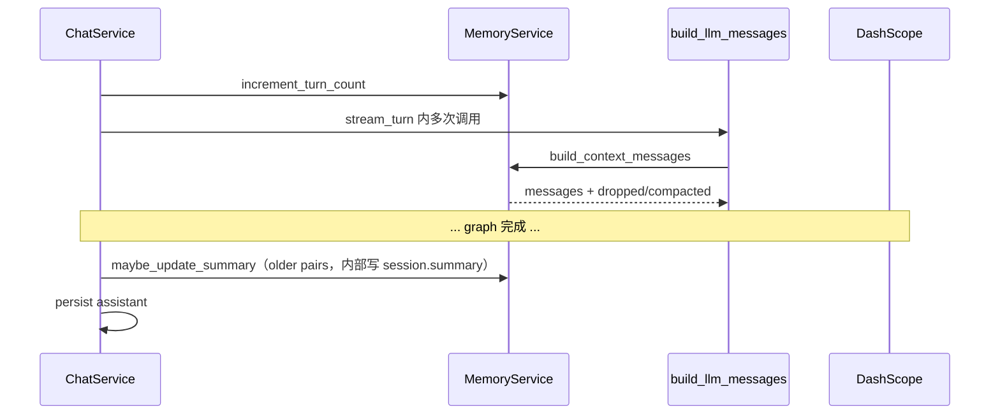

# 06 · 记忆与长上下文

| 元信息 | 内容 |
|--------|------|
| **预计阅读** | 25 分钟 |
| **前置知识** | [04-Agent编排深度解析](./04-Agent编排深度解析.md)、LLM context window 概念 |
| **相关 ADR** | [COACH_AGENT_REDESIGN](../specs/COACH_AGENT_REDESIGN.md) §3.14 |

---

## 本节你将学到

- `MemoryService` 如何构建 LLM messages（摘要 + 滑动窗口）
- `LONG_CONTEXT_MODE=summary|full` 两种模式差异
- 滚动摘要触发条件与 `ChatService` 调用时机
- token 估算裁剪与 `run_meta` 观测字段
- 与 LangGraph 图的边界（图内不更新摘要）
- 面试「长对话怎么做」标准答法

---

## 1. 问题定义

运动 Coach 需多轮对话记住：用户目标、伤病史、上周训练反馈。直接塞全历史会：

- 超出 context window → 成本与截断风险
- 引入噪声 → 意图漂移

本项目策略：**滑动窗口 + 可选滚动摘要**（默认 `summary` 模式）；预留 `full` 模式对接 `qwen-long`。

---

## 2. 架构位置

```text
ChatService
  ├─ increment_turn_count        （user 消息入库时）
  ├─ orchestrator.stream_turn    （图内只读记忆）
  └─ maybe_update_summary        （_complete_turn_events 内，assistant 入库**前**）

LangGraph nodes
  └─ build_llm_messages
        └─ MemoryService.build_context_messages  （读 session.summary + 最近 N 轮）
```

**硬边界**：摘要更新**不在** LangGraph 内。`maybe_update_summary` 在 `_complete_turn_events` 里、**assistant 入库之前**执行，但只压缩 **older** 窗口（超出最近 `MEMORY_MAX_TURNS` 的历史对）；本轮 assistant 尚未写入 DB，也不会进入本次摘要输入。



---

## 3. build_context_messages 详解

**文件**：`backend/app/services/memory_service.py`

### 3.1 System 消息组装

```text
COACH_SYSTEM_PROMPT
+ 【会话摘要】（若 session.summary 非空）
+ context_block（画像、图谱、agent 角色、免责声明、CoT）
```

`context_block` 由 `build_llm_messages` 传入，**不含**历史轮次。

### 3.2 历史轮次选择

1. 查询 `chat_messages` 按时间升序
2. `exclude_message_id` 排除当前 user 消息（避免 duplicate，末尾再 append）
3. `_pair_messages`：配对用户/助手轮

**summary 模式**（默认）：

- 取最近 `MEMORY_MAX_TURNS=8` 对
- `dropped_message_count = max(0, 总对数 - 8)`

**full 模式**（`LONG_CONTEXT_MODE=full`）：

- 保留**全部** pair，不截轮数
- `_resolve_model_name()` 返回 `coach_long_context_model`（`qwen-long`）

### 3.3 Token 预算裁剪（仅 summary 模式）

估算：`estimate_tokens ≈ len(text)//4`

当总 token > `MEMORY_MAX_PROMPT_TOKENS=12000`：

- 从最早 user/assistant pair 弹出
- `dropped_message_count++`，`memory_compacted=true`

### 3.4 返回值 MemoryBuildResult

| 字段 | 用途 |
|------|------|
| `messages` | 送 LLM 的完整列表 |
| `dropped_message_count` | 写入 run_meta / CoachRunResult |
| `memory_compacted` | 是否发生 token 裁剪 |
| `model_name` | full 模式长上下文模型 hint |

`build_llm_messages` 将 compacted/dropped 同步到 `run_meta` 供 observability。

---

## 4. 滚动摘要 maybe_update_summary

### 4.1 触发条件

```text
session.turn_count > MEMORY_SUMMARY_TRIGGER_TURNS (12)
```

且存在 **older** 对话对（超出最近 `MEMORY_MAX_TURNS` 的部分）。

### 4.2 摘要输入

```text
已有摘要（若有）
+ older pairs 的用户/教练原文
```

### 4.3 LLM 调用

- System：`MEMORY_SUMMARY_SYSTEM_PROMPT`（`prompts/memory_summary_prompt.py`）
- Model：`coach_answer_model`（qwen-plus）
- 输出截断：`MEMORY_SUMMARY_MAX_CHARS=500`
- 写入：`session.summary`、`session.summary_updated_at`

### 4.4 ChatService 集成

`_complete_turn_events` 顺序：

1. `maybe_update_summary`（压缩 older 对；**早于** assistant 入库，见 §2 硬边界）
2. 若 updated → 合并 summary token 到 `CoachRunResult`
3. `insert assistant_message` + `commit`
4. `finalize_run(..., memory_summary_updated=...)`
5. yield `done`

可选 SSE：`phase=memory_summary`（`AGENT_ENABLE_THINKING_STEPS`，在 assistant commit 后的 step yield）

---

## 5. 两种长上下文模式对比

| 维度 | `summary`（默认） | `full` |
|------|-------------------|--------|
| 历史轮次 | 最近 8 对 + 摘要 | 全部 pair |
| 超长裁剪 | token > 12000 弹最早对 | 不裁剪 |
| 摘要更新 | turn>12 压缩 older | 仍可用摘要减噪 |
| 模型 hint | qwen-plus | qwen-long |
| 适用 | 生产默认、成本可控 | 演示/评测超长上下文 |

测试：`test_long_context_mode.py`、`test_memory.py`。

---

## 6. 用户消息长度限制

`validate_user_message_length`：`len(content) > MEMORY_MAX_USER_CHARS(8000)` → `ValueError`，ChatService yield error。

防止单轮撑爆 context 与 DB。

---

## 7. 与 Agent 节点的交互

所有需要历史的节点经 `build_llm_messages`：

- `sub_agent`（各 agent_key）
- `coach_chitchat`
- `synthesize`（合并任务时另 append merge_context）

**当前 user 消息**：

- 若不在 history 列表中 → append 到 messages 末尾
- sub_agent 额外 append `【本轮子目标】{task_goal}`

Planner/router **不**走 MemoryService（仅看本轮 `user_message` + profile JSON）。

---

## 8. 完整示例：15 轮对话时 LLM 看到什么

假设 `MEMORY_MAX_TURNS=8`、`MEMORY_SUMMARY_TRIGGER_TURNS=12`、`turn_count=15`，且第 13 轮后摘要已更新。

| 存储位置 | 内容 |
|----------|------|
| `session.summary` | 「用户目标增肌，肩袖旧伤，偏好居家训练…」（≤500 字） |
| DB 全量 messages | 15 对 user/assistant |
| `build_context_messages` 输出 | system（prompt + **摘要** + 画像 + 图谱 + 角色）+ **最近 8 对** + 当前 user（exclude 后 append） |
| `dropped_message_count` | 15 - 8 = **7**（仅统计「轮次窗口」丢弃；token 裁剪另计） |

第 1–7 轮原文 **不在** messages 里，但若已触发 summary，其语义应在 `session.summary` 中。若 summary LLM 失败，第 1–7 轮信息 **可能永久不可见**——这是 summary 模式的核心 trade-off。

### 8.1 Token 预算裁剪逐步演示

设 system+8 轮估算 13,500 tokens > `MEMORY_MAX_PROMPT_TOKENS=12000`：

```text
循环 while tokens > 12000:
  pop messages[1]  # 最早 user
  若下一条是 assistant → 再 pop
  dropped_message_count += 1
  memory_compacted = true
```

裁剪 **只动 user/assistant 对**，不动 system 块（含摘要、画像、RAG 图谱）。因此极端长画像或 graph_context 仍可能撑高 token——需控制 `context_block` 长度。

---

## 9. _pair_messages 边界情况

`memory_service._pair_messages` 线性扫描 `chat_messages`（按 `created_at` 升序）：

| 场景 | 配对结果 |
|------|----------|
| 正常 user → assistant | `(user, assistant)` 一对 |
| 连续两条 user | 第一条 user 等待；第二条覆盖 `pending_user`（前一条 user **丢失配对**） |
| assistant 无前置 user | `(None, assistant)`  orphan assistant |
| 末尾仅 user（当前轮） | `(user, None)`；通常被 `exclude_message_id` 排除 |

**设计含义**：ChatService 保证 user 先 commit 再跑图，assistant 在 `_complete_turn_events` 写入，正常不会出现 orphan。Benchmark 清会话时不依赖 summary。

---

## 10. 与 build_llm_messages 的分工

```text
MemoryService.build_context_messages
  → system = COACH_SYSTEM + 【会话摘要】 + context_block（画像/图谱/角色/免责/CoT）

build_llm_messages 额外 append:
  → 当前 user_message（若不在 history）
  → 【本轮子目标】（sub_agent 专用）
```

同一会话 **每调一次** `build_llm_messages` 都会重新查 DB 构建 history——并行 sub_agent 各调一次，共 N 次相同 SQL。这是用 **读放大** 换实现简单；会话规模下可接受。

`run_meta["dropped_message_count"]` 取多次调用中的 **max**，`memory_compacted` 任一为 true 则 true。

---

## 11. 观测字段

`CoachRunResult` / `agent_runs` 表：

- `memory_compacted`
- `dropped_message_count`
- `memory_summary_updated`（finalize_run）

便于分析「答非所问」是否因记忆裁剪。

---

## 12. 设计权衡（Interview）

**为什么不用向量记忆库？**  
会话规模中等，摘要+8 轮足够；向量记忆增加 ingest 与检索复杂度，ROI 低。

**摘要为何在 assistant 入库之前执行？**  
`maybe_update_summary` 只读 **older** 历史对（完整 user/assistant），不依赖本轮 assistant。本轮回复入库后，会在后续 turn 的 older 窗口移入时再被压缩。

**为什么摘要不放 LangGraph？**  
与 ChatService 写库同一事务边界；避免图重试导致重复摘要 LLM 调用。

---

## 代码锚点表

| 路径 | 职责 |
|------|------|
| `backend/app/services/memory_service.py` | 记忆核心 |
| `backend/app/services/chat_service.py` | turn_count、摘要时机 |
| `backend/app/agent/coach/nodes/build_llm_messages.py` | 记忆+画像注入 |
| `backend/app/prompts/memory_summary_prompt.py` | 摘要 system prompt |
| `backend/app/prompts/coach_system_prompt.py` | 教练 system prompt |
| `backend/app/core/config.py` | LONG_CONTEXT_MODE 等 |
| `backend/app/db/models.py` | ChatSession.summary, turn_count |
| `backend/tests/test_memory.py` | 窗口与裁剪 |
| `backend/tests/test_long_context_mode.py` | full 模式 |
| `backend/tests/test_build_llm_messages.py` | 集成 build |
| `frontend/src/components/chat/SessionPanel.tsx` | 会话列表 UI |

---

## 常见追问

### Q1：8 轮和 12 轮 trigger 为何不一致？

**答**：8 轮是 LLM **可见**窗口；12 轮才触发摘要是避免短会话浪费 summary LLM。older 超出 8 的部分靠摘要保留。

**追问链**：
- *追问*：turn_count 何时加？→ 每条 user 消息入库时 increment，含失败回合前的 user 侧。

### Q2：摘要失败怎么办？

**答**：catch 异常 log，`SummaryUpdateResult(updated=False)`，主链路不受影响。

### Q3：full 模式会自动切 qwen-long 吗？

**答**：`MemoryBuildResult.model_name` 提供 hint；实际 chat 调用仍看各节点 `settings.coach_answer_model`，full 模式主要用于测试与预留扩展。

### Q4：并行 sub_agent 共享记忆吗？

**答**：共享同一 `build_context_messages` 结果，各 agent 同一 system+历史，仅 `task_goal` 不同。

### Q5：如何调试「忘了前面说过的话」？

**答**：查 session.summary、turn_count、dropped_message_count；调大 `MEMORY_MAX_TURNS` 或降低 trigger。

### Q6：token 估算为何 len/4？

**答**：轻量启发式，中英混合近似；不做 tiktoken 依赖。超限时宁可多裁。

### Q7：新会话 summary 从哪来？

**答**：空；随 turn 增加逐步积累，older pair 压缩进 summary。

---

## 延伸阅读

- [LLM_ARCHITECTURE](../reference/LLM_ARCHITECTURE.md) — 长上下文与位置编码
- [04-Agent编排深度解析](./04-Agent编排深度解析.md) — build_llm_messages 调用链
- [COACH_AGENT_REDESIGN](../specs/COACH_AGENT_REDESIGN.md) — §3.14 记忆配置
- [01-项目概览与边界](./01-项目概览与边界.md) — ChatService 职责
