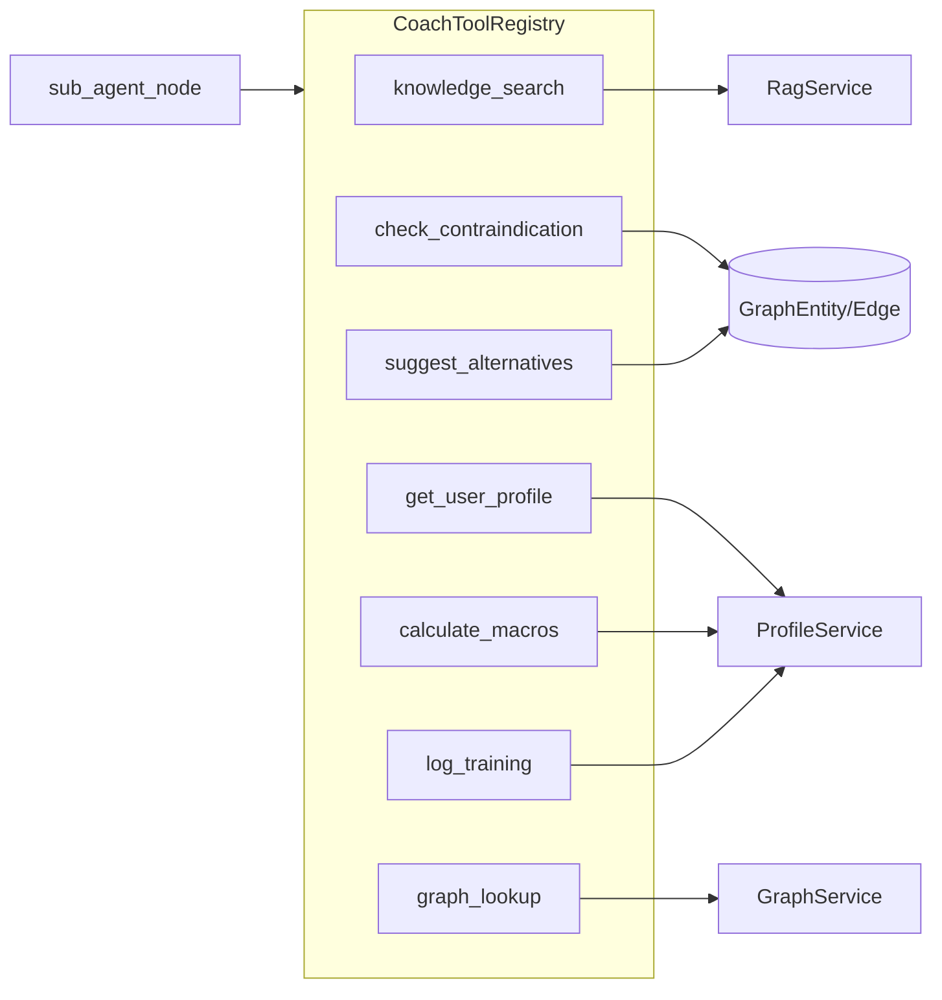

# 07 — 工具系统详解

> **阅读时间**：约 45 分钟  
> **前置章节**：[04-Agent编排深度解析](04-Agent编排深度解析.md)、[05-RAG与Graph-RAG](05-RAG与Graph-RAG.md)  
> **相关 ADR**：[ADR-001](../decisions/ADR-001-langgraph-without-langchain-adapter.md)、[ADR-005](../decisions/ADR-005-graph-rag-as-supplement.md)

---

## 本节你将学到

- Coach Agent 的 **7 个领域工具** 各自职责、JSON Schema、返回值与典型调用场景
- `ToolContext` 如何把 DB 会话、用户、RAG 开关注入工具执行
- `CoachToolRegistry` 注册、条件启用（`graph_lookup`）与 `sub_agent` ReAct 循环的衔接
- 面试中如何讲清「工具 vs RAG prefetch」「静态 fallback vs 图谱查询」的设计取舍

---

## 1. 工具系统总览

本项目的工具层服务于 **sub_agent ReAct 循环**：LLM 在 `sub_agent_node` 中通过 DashScope function calling 选择工具，`CoachToolRegistry.execute()` 分发到具体实现，结果以 `role=tool` 消息回注，最多迭代 `sub_agent_max_tool_steps`（默认 4）轮。

```text
sub_agent_node
    │
    ├─ registry.list_schemas()  → OpenAI function JSON
    ├─ llm.chat_stream_with_tools(messages, schemas)
    │
    └─ for each ToolCallComplete:
           registry.execute(name, ToolContext, arguments)
           → emit SSE tool_call / tool_result（可选）
           → append tool message → 下一轮 LLM
```

**与 knowledge_prefetch 的区别**：`knowledge_prefetch_node` 在 chitchat 路径上**预取** RAG，不经过工具注册表；sub_agent 路径上的 `knowledge_search` 是 LLM **主动决策**调用，两者可并存但触发时机不同。

### 1.1 架构示意



---

## 2. 公共基础设施

### 2.1 ToolContext

所有工具通过统一的 `ToolContext` 获取运行时依赖，避免在 schema 里暴露 `user_id` 等敏感参数（由服务端注入，防 prompt injection）。

| 字段 | 类型 | 用途 |
|------|------|------|
| `db` | `AsyncSession` | 异步 DB 会话 |
| `user_id` | `UUID` | 当前登录用户 |
| `session_id` | `UUID` | 聊天会话 |
| `message_id` | `UUID` | 本轮 user message |
| `run_id` | `UUID` | AgentRun 观测 ID |
| `use_rag` | `bool` | 用户/配置是否开启 RAG |

```8:15:backend/app/agent/tools/base.py
@dataclass
class ToolContext:
    db: AsyncSession
    user_id: uuid.UUID
    session_id: uuid.UUID
    message_id: uuid.UUID
    run_id: uuid.UUID
    use_rag: bool
```

### 2.2 CoachToolRegistry

`build_default()` 根据配置组装工具字典；`graph_lookup` 仅在 `settings.graph_rag_enabled=True` 时注册。

```17:71:backend/app/agent/tools/registry.py
class CoachToolRegistry:
    def __init__(self, ...) -> None:
        self._tools: dict[str, Any] = { ... }
        if graph_lookup_tool is not None:
            self._tools[graph_lookup_tool.name] = graph_lookup_tool

    @classmethod
    def build_default(cls, rag_service, *, profile_service=None, graph_service=None):
        graph_tool = GraphLookupTool(graph_service) if settings.graph_rag_enabled else None
        ...

    async def execute(self, name: str, ctx: ToolContext, arguments: dict) -> dict:
        tool = self._tools.get(name)
        if tool is None:
            raise ValueError(f"未知工具: {name}")
        return await tool.run(ctx, arguments)
```

**面试要点**：工具名未知时抛 `ValueError`，sub_agent 捕获后写入 `status: error`，不会中断整图——这是 **graceful degradation** 而非 fail-fast。

---

## 3. 七个工具逐一解析

### 3.1 knowledge_search — 混合 RAG 检索

| 属性 | 值 |
|------|-----|
| 文件 | `backend/app/agent/tools/knowledge.py` |
| 依赖 | `RagService.retrieve()` |
| 典型 Agent | training、nutrition、safety |

**Schema**

```json
{
  "name": "knowledge_search",
  "parameters": {
    "type": "object",
    "properties": {
      "query": { "type": "string", "description": "检索 query" },
      "top_k": { "type": "integer", "description": "返回条数，可选" }
    },
    "required": ["query"]
  }
}
```

**返回值**

```python
{"citations": [...], "output_preview": "前 3 条摘要拼接"}
```

**关键逻辑**

- `ctx.use_rag=False` 时直接返回空 citations，preview 为「知识库检索已关闭」——尊重前端 Chat 页的 RAG 开关。
- citations 写入 `AgentStep.payload.tool_calls` 与 assistant `retrieved_chunks`，并参与 `CoachGuardrails.citations_valid()` Citation Guard。

**典型用例**

- 用户问「深蹲膝盖内扣怎么纠正？」→ training sub_agent 调用，拉取训练技术文档片段。
- Benchmark 样本标注 `must_cite: true` 时，评测检查 `len(citations) > 0`。

---

### 3.2 check_contraindication — 禁忌检查

| 属性 | 值 |
|------|-----|
| 文件 | `backend/app/agent/tools/contraindication.py` |
| 数据源 | Graph `contraindicated_for` 边 + `STATIC_CONTRAINDICATIONS` |
| 典型 Agent | safety、training |

**Schema**

```json
{
  "name": "check_contraindication",
  "parameters": {
    "properties": {
      "exercise": { "type": "string" },
      "conditions": { "type": "array", "items": { "type": "string" } }
    },
    "required": ["exercise", "conditions"]
  }
}
```

**返回值**

```python
{
  "contraindicated": bool,
  "reasons": ["深蹲 对 膝盖损伤 可能存在禁忌", ...],
  "matched_rules": ["graph:膝盖损伤", "static:急性膝痛"],
  "exercise": "...",
  "conditions": [...]
}
```

**双层匹配策略**

1. **图谱**：`GraphEntity.name ILIKE %exercise%` → 查 `relation_type=contraindicated_for` 出边 → 与用户 `conditions` 子串互匹配。
2. **静态表**：`STATIC_CONTRAINDICATIONS` 覆盖深蹲、硬拉、颈后推举、跑步等高频动作，图谱无数据时仍可回答。

**面试追问**：为什么不只靠 LLM 常识？——图谱+静态规则可 **可追溯、可评测**（benchmark `must_include_tools: ["check_contraindication"]`），且降低幻觉风险。

---

### 3.3 get_user_profile — 读取健身画像

| 属性 | 值 |
|------|-----|
| 文件 | `backend/app/agent/tools/profile.py` |
| 依赖 | `ProfileService.get_profile()` |
| 典型 Agent | profile、training、nutrition |

**Schema**：无参数（`required: []`）。

**返回值**：`{"profile": { height_cm, weight_kg, goals, injuries, equipment, ... }}`

**用例**：制定计划前拉取身高体重、伤病史、可用器械；`load_profile_node` 也会预加载画像到 state，工具调用用于 sub_agent **按需刷新**或 profile 意图专路径。

---

### 3.4 calculate_macros — 宏量营养估算

| 属性 | 值 |
|------|-----|
| 文件 | `backend/app/agent/tools/macros.py` |
| 公式 | Mifflin-St Jeor BMR × activity_factor |
| 典型 Agent | nutrition |

**Schema**

```json
{
  "properties": {
    "activity_factor": { "type": "number", "description": "1.2-1.9，默认 1.55" }
  },
  "required": []
}
```

**返回值**

```python
{
  "bmr_kcal": int,
  "tdee_kcal": int,
  "protein_g": int,   # weight × 1.8
  "carb_g": int,
  "fat_g": int,       # weight × 0.8
  "note": "维持热量 | 轻度热量缺口 | 轻度热量盈余",
  "based_on_profile": { ... }
}
```

**目标调节**：profile.goals 含「减脂/减重」→ TDEE × 0.85；含「增肌」→ × 1.1。

**设计取舍**：营养建议由 **确定性公式** 产出，LLM 负责解释而非心算——面试可说这是 **tool-augmented generation** 减少数值幻觉。

---

### 3.5 log_training — 训练日志落库

| 属性 | 值 |
|------|-----|
| 文件 | `backend/app/agent/tools/training_log.py` |
| 依赖 | `ProfileService.create_training_log()` |
| 典型 Agent | training、profile |

**Schema**

```json
{
  "required": ["session_date", "activity_type", "duration_min", "intensity"],
  "properties": {
    "session_date": { "type": "string", "description": "YYYY-MM-DD" },
    "activity_type": { "type": "string" },
    "duration_min": { "type": "integer" },
    "intensity": { "type": "string", "description": "low/moderate/high" },
    "notes": { "type": "string" }
  }
}
```

**副作用**：向 `training_logs` 表 INSERT——唯一的 **写操作型** 工具（profile 更新走 Profile API，不经工具）。

**用例**：用户说「帮我记一下今天练了 45 分钟力量」→ LLM 解析日期与强度后调用。

---

### 3.6 suggest_alternatives — 替代动作推荐

| 属性 | 值 |
|------|-----|
| 文件 | `backend/app/agent/tools/alternatives.py` |
| 数据源 | Graph `alternative_for` 边 + `fallback_map` |
| 典型 Agent | safety、training |

**Schema**

```json
{
  "required": ["exercise"],
  "properties": {
    "exercise": { "type": "string" },
    "injury_or_limit": { "type": "string" },
    "equipment": { "type": "array", "items": { "type": "string" } }
  }
}
```

**查询方向**：与 `check_contraindication` 相反——查 `target_id == source.id` 且 `relation_type=alternative_for`，即「谁可替代该动作」。

**Fallback**：图谱无结果时用硬编码映射（如深蹲 → 箱式深蹲、保加利亚分腿蹲、臀桥）。

---

### 3.7 graph_lookup — 一跳图谱上下文

| 属性 | 值 |
|------|-----|
| 文件 | `backend/app/agent/tools/graph_lookup.py` |
| 依赖 | `GraphService.build_one_hop_context()` |
| 启用条件 | `GRAPH_RAG_ENABLED=true`（默认开启） |

**Schema**

```json
{
  "required": ["entity_name"],
  "properties": {
    "entity_name": { "type": "string" },
    "entity_type": { "type": "string", "description": "exercise/injury/nutrient" }
  }
}
```

**返回值**

```python
{
  "context": "一跳邻接自然语言描述",
  "entities": ["深蹲"],
  "entity_type": "exercise",
  "output_preview": "context 前 120 字"
}
```

**与 contraindication/alternatives 的分工**：`graph_lookup` 返回 **通用邻接上下文**；后两者是 **封装好的领域查询**（固定 relation_type + 业务字段），LLM 按任务复杂度选择。

---

## 4. 工具调用全链路（代码锚点）

| 阶段 | 文件 | 函数/节点 |
|------|------|-----------|
| Schema 收集 | `registry.py` | `list_schemas()` |
| LLM 发起调用 | `sub_agent.py` | `chat_stream_with_tools` |
| SSE 透出 | `sub_agent.py` | `emit("tool_call")` / `emit("tool_result")` |
| 执行 | `registry.py` | `execute()` |
| 观测落库 | `observability_service.py` | `append_step` payload 含 tool_calls |
| 前端展示 | `useSessions.ts` | `handleEvent` tool_call/tool_result 分支 |

```117:157:backend/app/agent/coach/nodes/sub_agent.py
            for tc in pending_tool_calls:
                if emit and sse_enabled:
                    await emit("tool_call", {"tool": tc.name, "arguments": tc.arguments, ...})
                try:
                    result = await registry.execute(tc.name, tool_ctx, tc.arguments)
                    status = "ok"
                except Exception as exc:
                    result = {"error": str(exc)}
                    status = "error"
                ...
                if emit and sse_enabled:
                    await emit("tool_result", {"tool": tc.name, "output_preview": preview, ...})
```

---

## 5. 工具 × 意图 × Agent 对照表

| 工具 | training | nutrition | safety | profile | chitchat |
|------|:--------:|:---------:|:------:|:-------:|:--------:|
| knowledge_search | ✓ | ✓ | ✓ | △ | prefetch |
| check_contraindication | ✓ | — | ✓ | — | — |
| get_user_profile | ✓ | ✓ | △ | ✓ | — |
| calculate_macros | △ | ✓ | — | △ | — |
| log_training | ✓ | — | — | ✓ | — |
| suggest_alternatives | ✓ | — | ✓ | — | — |
| graph_lookup | ✓ | △ | ✓ | — | — |

（✓ 高频；△ 偶发；— 通常不触发；chitchat 走 prefetch 而非 sub_agent 工具环）

---

## 6. 代码锚点速查表

| 概念 | 路径 |
|------|------|
| 工具协议 | `backend/app/agent/tools/base.py` |
| 注册表 | `backend/app/agent/tools/registry.py` |
| 7 工具实现 | `backend/app/agent/tools/*.py` |
| ReAct 执行 | `backend/app/agent/coach/nodes/sub_agent.py` |
| RAG 服务 | `backend/app/services/rag_service.py` |
| 画像服务 | `backend/app/services/profile_service.py` |
| 图谱服务 | `backend/app/services/graph_service.py` |
| 图谱模型 | `backend/app/db/models.py` (GraphEntity, GraphEdge) |
| 工具单测 | `backend/tests/test_coach_tools.py`, `test_registry.py` |

---

## 7. 常见追问

### Q1：为什么用 Registry 而不是 LangChain @tool 装饰器？

**答**：项目需要统一 `ToolContext` 注入、条件注册（graph_lookup）、以及与 DashScope function schema 格式对齐；自研 Registry 约 70 行，依赖更可控。

**追问链**
- *追问*：新增第 8 个工具要改几处？  
  *答*：新建 `tools/xxx.py` → `registry.build_default` 注册 → 可选 benchmark 样本标注 `must_include_tools` → 补 `test_coach_tools.py`。
- *追问*：工具 schema 会暴露给前端吗？  
  *答*：不会；仅后端 LLM API 使用，前端只看到 SSE `tool_call` 事件里的 name/arguments。

### Q2：use_rag=false 时 knowledge_search 还注册吗？

**答**：仍注册，但 `run()` 内短路返回空 citations。这样 LLM 调用不会报错，且 guardrails 的 `knowledge_searched` 仍为 true——Citation Guard 可能触发 fallback 文案。

**追问链**
- *追问*：prefetch 路径也受 use_rag 影响吗？  
  *答*：是，state 携带 `use_rag`，prefetch 与工具共用同一开关。

### Q3：静态禁忌表与图谱会不会冲突？

**答**：合并输出 `reasons`，`matched_rules` 带来源标签 `graph:` / `static:`，两者互补：图谱可扩展，静态表保证 demo 可评测。

### Q4：log_training 为何不做成 API 由前端调用？

**答**：对话式记录更贴合 Coach 场景（用户自然语言描述训练）；写库经 ToolContext 绑定 user_id，权限已在 JWT 层校验。

### Q5：工具执行失败会怎样？

**答**：`result={"error": str(exc)}`, `status=error`，消息回注 LLM 可换策略；SSE 仍发 `tool_result`，前端 steps 面板可见。

### Q6：graph_lookup 关闭后 contraindication 还能用图谱吗？

**答**：能。`check_contraindication` 直接查 `GraphEntity/GraphEdge`，不经过 `graph_lookup` 工具；关闭的是 **LLM 主动查一跳上下文** 的能力。

### Q7：如何评测工具召回？

**答**：`coach_eval.jsonl` 字段 `must_include_tools`；`benchmark_runner.extract_tool_names()` 从 `AgentStep.payload.tool_calls` 提取，计算 `tools_covered`。

### Q8：output_preview 字段用途？

**答**：压缩工具结果用于 SSE `tool_result` 与观测摘要，避免把完整 citations JSON 推到前端。

---

## 延伸阅读

- [05-RAG与Graph-RAG](05-RAG与Graph-RAG.md) — `knowledge_search` 底层检索
- [04-Agent编排深度解析](04-Agent编排深度解析.md) — sub_agent ReAct 循环
- [09-评测与观测](09-评测与观测.md) — `must_include_tools` 评测逻辑
- [10-安全护栏与RBAC](10-安全护栏与RBAC.md) — Citation Guard 与 citations 关系
- [../reference/AGENT_SSE.md](../reference/AGENT_SSE.md) — `tool_call` / `tool_result` 事件契约
- [../specs/COACH_AGENT_REDESIGN.md](../specs/COACH_AGENT_REDESIGN.md) — §3.4 工具清单原始规格
