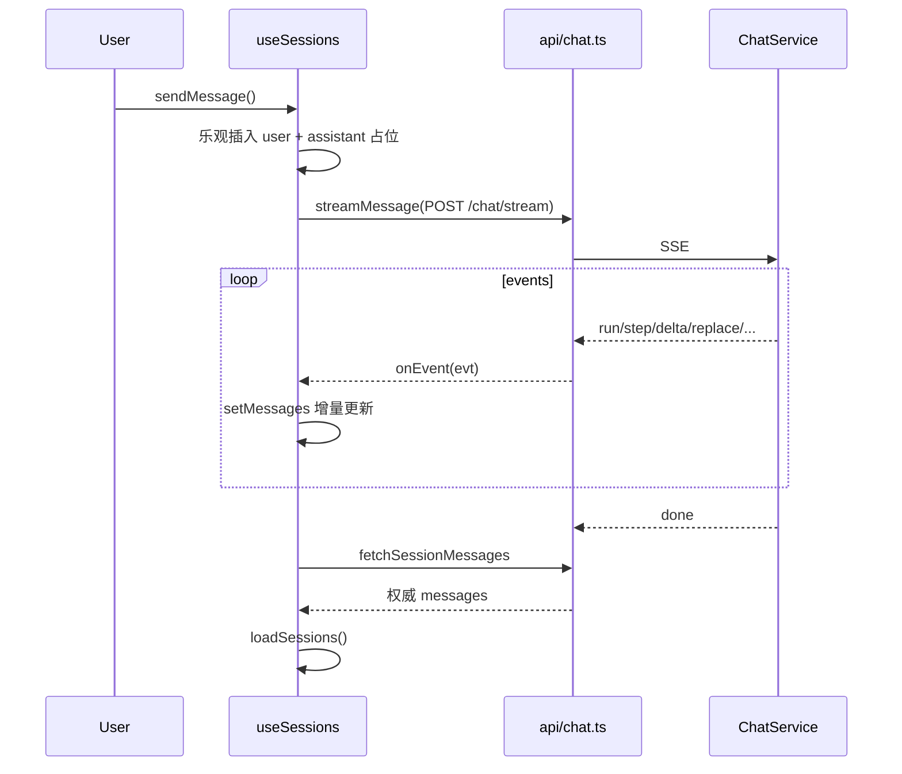

# 08 — 前端与 SSE

> **阅读时间**：约 40 分钟  
> **前置章节**：[03-系统架构与分层](03-系统架构与分层.md)、[04-Agent编排深度解析](04-Agent编排深度解析.md)  
> **相关 ADR**：[ADR-003](../decisions/ADR-003-sse-replace-vs-delta.md)

---

## 本节你将学到

- 前端如何通过 `fetch` + `ReadableStream` 消费 SSE，而非 EventSource
- `useSessions.ts` 对 9 种 `StreamEvent` 的分发与乐观 UI 策略
- `replace` vs `delta` 正文契约及与 guardrails 的配合
- React Router 路由守卫 + Sidebar RBAC 如何与后端 `permissions` 对齐
- 各 Page 组件职责与数据流边界

---

## 1. 前端技术栈与入口

| 层 | 技术 | 入口 |
|----|------|------|
| 构建 | Vite 6 + React 19 | `frontend/src/main.tsx` |
| 路由 | React Router 7 `createBrowserRouter` | `frontend/src/router.tsx` |
| 全局状态 | Context（Auth + App 错误条） | `AuthContext.tsx`, `AppContext.tsx` |
| API | 原生 `fetch` 封装 | `frontend/src/api/*.ts` |
| 类型 | 集中导出 | `frontend/src/types/index.ts` |

```6:13:frontend/src/App.tsx
export function App() {
  return (
    <AuthProvider>
      <AppProvider>
        <RouterProvider router={router} />
      </AppProvider>
    </AuthProvider>
  );
}
```

**设计原则**：聊天状态放在 `useSessions` hook 而非全局 store——单页 Chat 域内聚，避免 Redux/Zustand 过度工程。

---

## 2. SSE 传输层：`api/chat.ts`

### 2.1 为何不用 EventSource？

`POST /chat/stream` 需要在 body 传 `session_id`、`message`、`use_rag`，原生 `EventSource` 仅支持 GET。因此使用 `fetch` + `response.body.getReader()` 手动解析 SSE 帧。

```53:90:frontend/src/api/chat.ts
export async function streamMessage(
  token: string,
  payload: { session_id?: string; message: string; use_rag: boolean },
  onEvent: (event: StreamEvent) => void
): Promise<void> {
  const response = await fetch(`${API_BASE}/chat/stream`, {
    method: "POST",
    headers: buildHeaders(token, { "Content-Type": "application/json" }),
    body: JSON.stringify(payload),
  });
  ...
  while (true) {
    const { done, value } = await reader.read();
    if (done) break;
    buffer += decoder.decode(value, { stream: true });
    const chunks = buffer.split("\n\n");
    buffer = chunks.pop() || "";
    for (const block of chunks) {
      const line = block.split("\n").find((item) => item.startsWith("data: "));
      if (!line) continue;
      try {
        onEvent(JSON.parse(line.slice(6)));
      } catch {
        // ignore malformed event
      }
    }
  }
}
```

**解析要点**

- 以 `\n\n` 切分 SSE event block（兼容后端 `data: {...}\n\n`）
- 半包粘包：`buffer` 保留未完成块
- 畸形 JSON 静默忽略，不中断流——与后端 `PUBLIC_ERROR_MESSAGE` 策略配合

### 2.2 后端 SSE 发出方

| 事件 | 发出方 | 是否到客户端 |
|------|--------|-------------|
| `run`, `step`, `tool_*`, `delta`, `replace`, `session` | Orchestrator → ChatService 转发 | ✓ |
| `result` | Orchestrator | ✗（ChatService 吞掉） |
| `done` | ChatService `_complete_turn_events` | ✓ |
| `error` | 任一方 | ✓ |

详见 [../reference/AGENT_SSE.md](../reference/AGENT_SSE.md)。

---

## 3. SSE 事件契约与 UI 映射

### 3.1 StreamEvent 类型定义

```62:82:frontend/src/types/index.ts
export type StreamEvent = {
  type: string;
  content?: string;
  session_id?: string;
  citations?: Citation[];
  message?: string;
  run_id?: string;
  trace_id?: string;
  phase?: string;
  summary?: string;
  step_index?: number;
  detail?: Record<string, unknown>;
  tool?: string;
  arguments?: Record<string, unknown>;
  output_preview?: string;
  status?: string;
  step_count?: number;
  latency_ms?: number;
  model_name?: string;
  assistant_message_id?: string;
};
```

### 3.2 正文流：delta vs replace

```text
单 agent / chitchat / 安全拦截：
  synthesize → replace（整段）→ [apply_guardrails → replace] → done

多 agent 合并（如 recovery）：
  synthesize → delta×N → [guardrails → replace] → done
```

| 事件 | `useSessions` 行为 | UI 效果 |
|------|-------------------|---------|
| `delta` | `content += evt.content` | 打字机追加 |
| `replace` | `content = evt.content` | 整段覆盖（护栏改写后） |

```193:206:frontend/src/hooks/useSessions.ts
      } else if (evt.type === "delta") {
        setMessages((prev) =>
          updateAssistant(prev, tempAssistantId, (item) => ({
            ...item,
            content: `${item.content}${evt.content || ""}`,
          }))
        );
      } else if (evt.type === "replace") {
        setMessages((prev) =>
          updateAssistant(prev, tempAssistantId, (item) => ({
            ...item,
            content: evt.content || "",
          }))
        );
```

**面试话术**：`replace` 是 **idempotent 全量快照**，适合护栏改写；`delta` 仅用于多 agent LLM 合并的流式体验，避免中途 replace 打断 UX。

### 3.3 事件处理总表

| type | 更新字段 | 说明 |
|------|----------|------|
| `run` | `runId`, `traceId` | 回合开始 |
| `session` | `activeSessionId`, `citations` | 新会话或 citations 快照 |
| `step` | `steps[]`, `intent` | routing 阶段写 intent |
| `tool_call` | `steps[]` | 追加 phase=tool_call |
| `tool_result` | `steps[]`, `citations` | 可能带 citations |
| `delta` / `replace` | `content` | 正文 |
| `done` | `id`, `runStatus`, `agent_trace_summary` | 替换临时 ID 为 DB id |
| `error` | — | `setError(message)` |

---

## 4. useSessions：会话状态机

### 4.1 状态一览

| 状态 | 类型 | 用途 |
|------|------|------|
| `sessions` | `SessionSummary[]` | 左侧列表 |
| `activeSessionId` | `string` | 当前会话 |
| `isDraftSession` | `boolean` | 新建未发首条消息 |
| `messages` | `LocalMessage[]` | 当前会话消息+流式临时项 |
| `useRag` | `boolean` | RAG 开关，传给 `/chat/stream` |
| `busy` | `boolean` | 发送中禁用输入 |

### 4.2 乐观 UI 与 sendMessage 流程

```106:238:frontend/src/hooks/useSessions.ts
  async function sendMessage() {
    ...
    const tempUserMessage = { id: crypto.randomUUID(), role: "user", ... };
    const tempAssistantId = crypto.randomUUID();
    setMessages((prev) => [...prev, tempUserMessage, { id: tempAssistantId, role: "assistant", content: "", steps: [] }]);

    const handleEvent = (evt: StreamEvent) => { ... };

    await streamMessage(token, { session_id: activeSessionId || undefined, message: draft, use_rag: useRag }, handleEvent);
    if (resolvedSessionId) {
      await loadSessionMessages(resolvedSessionId);  // 流结束后用 DB 权威数据覆盖
    }
    void loadSessions();
  }
```

**关键设计**

1. **双 UUID**：用户消息与 assistant 占位立即渲染，无需等首字节。
2. **`resolvedSessionId`**：`session` 事件可能创建新会话，需同步 `activeSessionId`。
3. **流结束 reload**：`loadSessionMessages` 用服务端 ID、citations、feedback 覆盖临时状态——解决 `done.assistant_message_id` 替换与刷新一致性。
4. **Draft 模式**：`startNewSession()` 清空 `activeSessionId`，首条消息 `session_id: undefined` 由后端创建会话。

### 4.3 会话生命周期示意



---

## 5. 页面组件架构

### 5.1 路由表

| 路径 | 组件 | 权限守卫 |
|------|------|----------|
| `/auth` | `AuthPage` | `GuestRoute`（已登录跳转 /chat） |
| `/chat` | `ChatPage` | 登录即可 |
| `/profile` | `ProfilePage` | 登录即可 |
| `/knowledge` | `KnowledgePage` | `knowledge:read` |
| `/agent-runs` | `AgentRunsPage` | `observability:read` |
| `/benchmark` | `BenchmarkDashboardPage` | `benchmark:read` 或 `benchmark:run` |
| `/users` | `UsersPage` | `user:manage` |

```99:126:frontend/src/router.tsx
export const router = createBrowserRouter([
  { path: "/auth", element: <GuestRoute><AuthPage /></GuestRoute> },
  {
    path: "/",
    element: <ProtectedRoute />,
    children: [
      {
        element: <MainLayout />,
        children: [
          { index: true, element: <Navigate to="/chat" replace /> },
          { path: "chat", element: <ChatPage /> },
          ...
          { path: "knowledge", element: <KnowledgeRoute /> },
          { path: "agent-runs", element: <AgentRunsRoute /> },
          { path: "benchmark", element: <BenchmarkRoute /> },
          { path: "users", element: <UsersRoute /> },
        ],
      },
    ],
  },
]);
```

`PermissionRoute` 无权限时 **静默重定向** `/chat`，而非 403 页——demo 产品简化处理。

### 5.2 ChatPage 组合

```7:44:frontend/src/pages/ChatPage.tsx
export function ChatPage() {
  const chat = useSessions();
  const { canSendChat, canWriteFeedback, canManageOwnSession, canManageAllSession } = usePermissions();
  ...
  return (
    <div className="chat-layout">
      <SessionPanel ... />
      <ChatWindow messages={chat.messages} onFeedback={...} />
      <ChatInput useRag={chat.useRag} onSubmit={...} />
    </div>
  );
}
```

| 子组件 | 职责 |
|--------|------|
| `SessionPanel` | 会话列表、新建/重命名/删除 |
| `ChatWindow` | 消息气泡、`AgentStepsPanel`、引用展示 |
| `ChatInput` | 输入框、RAG toggle、发送 |
| `MessageBubble` | Markdown 渲染、点赞踩 |
| `MarkdownContent` | 安全 Markdown 子集 |

### 5.3 其他页面速览

| 页面 | 数据来源 | 备注 |
|------|----------|------|
| `ProfilePage` | `api/profile.ts` | 健身画像 CRUD |
| `KnowledgePage` | `useKnowledge` + `api/knowledge.ts` | 上传/重索引 |
| `AgentRunsPage` | `api/observability.ts` | 运行列表 + timeline 详情 |
| `BenchmarkDashboardPage` | `api/benchmark.ts` | 轮询 2.5s、取消运行 |
| `UsersPage` | `useUsers` + `api/auth.ts` | admin 用户管理 |
| `AuthPage` | `AuthContext.loginUser` | JWT 存 localStorage |

---

## 6. RBAC：Sidebar 与权限钩子

### 6.1 usePermissions

权限钩子定义在 `AuthContext.tsx`（无独立 `PermissionContext`）：

```101:116:frontend/src/contexts/AuthContext.tsx
export function usePermissions() {
  const { permissions } = useAuth();
  return {
    canSendChat: permissions.has("chat:send"),
    canViewKnowledge: permissions.has("knowledge:read"),
    canViewObservability: permissions.has("observability:read"),
    canRunBenchmark: permissions.has("benchmark:run"),
    canReadBenchmark: permissions.has("benchmark:read"),
    canManageUsers: permissions.has("user:manage"),
    ...
  };
}
```

权限集合来自登录后 `/auth/me` 返回的 `user.permissions`（后端 `resolve_user_permissions` 计算）。

### 6.2 Sidebar 可见性

```31:43:frontend/src/components/layout/Sidebar.tsx
  const navItems: NavItem[] = [
    { to: "/chat", label: "Chat", visible: true },
    { to: "/profile", label: "Profile", visible: true },
    { to: "/knowledge", label: "Knowledge", visible: canViewKnowledge },
    { to: "/agent-runs", label: "Agent Runs", visible: canViewObservability },
    { to: "/benchmark", label: "Benchmark", visible: canReadBenchmark || canRunBenchmark },
    { to: "/users", label: "Users", visible: canManageUsers },
  ];
```

| 角色 | 可见菜单 |
|------|----------|
| `user` (coach_demo) | Chat, Profile |
| `kb_editor` (kb_demo) | + Knowledge |
| `admin` (admin_demo) | + Agent Runs, Benchmark, Users |

**纵深防御**：Sidebar 隐藏 + `PermissionRoute` 拦截 + 后端 `require_permissions` 三层一致。

### 6.3 Auth 启动流程

```29:48:frontend/src/contexts/AuthContext.tsx
  useEffect(() => {
    if (!token) return;
    void (async () => {
      const profile = await fetchMe(token);
      setMe(profile);
      setPermissionMatrix(await fetchPermissionMatrix(token));
    })();
  }, [token]);
```

Token 失效 → 清 localStorage → 重定向 `/auth`（`ProtectedRoute`）。

---

## 7. API 客户端层

```1:7:frontend/src/api/index.ts
export * from "./auth";
export * from "./benchmark";
export * from "./chat";
export * from "./knowledge";
export * from "./observability";
export * from "./profile";
export { API_BASE } from "./client";
```

`client.ts` 统一：

- `API_BASE` = `VITE_API_BASE_URL` 或 `http://localhost:8000`
- `buildHeaders` 附加 `Authorization: Bearer`
- `apiFetch` / `parseError` 处理 FastAPI `detail` 字段

---

## 8. MainLayout 与全局错误

```5:25:frontend/src/layouts/MainLayout.tsx
export function MainLayout() {
  const { error, clearError } = useApp();
  return (
    <div className="app-shell">
      <Sidebar />
      <main>
        <Outlet />
        {error ? <div className="toast toast--error">{error}</div> : null}
      </main>
    </div>
  );
}
```

`useSessions`、`AgentRunsPage` 等通过 `setError` 上报；流式 `error` 事件与 HTTP 4xx 共用同一 toast。

---

## 9. 代码锚点速查表

| 概念 | 路径 |
|------|------|
| SSE 解析 | `frontend/src/api/chat.ts` |
| 流式状态机 | `frontend/src/hooks/useSessions.ts` |
| 事件类型 | `frontend/src/types/index.ts` |
| 路由守卫 | `frontend/src/router.tsx` |
| 权限钩子 | `frontend/src/contexts/AuthContext.tsx` |
| 导航 RBAC | `frontend/src/components/layout/Sidebar.tsx` |
| Chat UI | `frontend/src/pages/ChatPage.tsx`, `components/chat/*` |
| 后端 SSE 源 | `backend/app/api/chat.py`, `services/chat_service.py` |
| SSE 契约文档 | `docs/reference/AGENT_SSE.md` |

---

## 10. 常见追问

### Q1：SSE 断了怎么办？

**答**：当前无自动重连；`streamMessage` throw 后 `setError` 展示，用户需重发。临时 assistant 气泡可能留空——可改进为标记 failed。面试可补充：应用层可用 `run_id` 对账 `/observability/runs/{id}`。

**追问链**
- *追问*：为何不用 WebSocket？  
  *答*：单向推送 + HTTP 基础设施简单；鉴权复用 Bearer header；k6 压测脚本已覆盖 SSE。

### Q2：为何流结束后还要 loadSessionMessages？

**答**：临时 `crypto.randomUUID()` 与 DB 真实 `assistant_message_id` 不一致；citations、feedback 以 DB 为准；避免 delta/replace 与最终入库文本漂移。

**追问链**
- *追问*：会不会闪屏？  
  *答*：有可能；优化方向是 done 时只 patch id/feedback 而非全量替换。

### Q3：PermissionRoute 重定向而非 403 页？

**答**：Demo 产品三类账号，普通用户不应看到无权限菜单；即使手动输入 URL 也回到 Chat，降低支持成本。

### Q4：useRag 存在哪？

**答**：`useSessions` 本地 state，非持久化；每次发送带入 payload，后端写入 `CoachState.use_rag`。

### Q5：tool_call 事件为何塞进 steps 而非独立状态？

**答**：`AgentStepsPanel` 统一时间线展示；与 `step` 事件共用 `AgentStepEvent[]` 结构，减少组件 props。

### Q6：CORS 与 SSE？

**答**：后端 `CORSMiddleware` 允许 `localhost:5173`；`StreamingResponse` 设 `Cache-Control: no-cache`, `X-Accel-Buffering: no` 防 nginx 缓冲。

### Q7：前端如何知道 intent？

**答**：`step` 事件 `phase===routing` 且 `detail.intent` 时写入 `LocalMessage.intent`，仅供调试展示，不参与业务逻辑。

### Q8：benchmark 会话为何不在 Chat 列表正常操作？

**答**：后端 `is_benchmark_chat_session` 拦截读写；标题前缀 `benchmark:`，防止污染用户会话。

---

## 延伸阅读

- [04-Agent编排深度解析](04-Agent编排深度解析.md) — Orchestrator `emit` 与 SSE 源
- [10-安全护栏与RBAC](10-安全护栏与RBAC.md) — 三角色与权限矩阵
- [12-代码导读-前端关键路径](12-代码导读-前端关键路径.md) — hooks 全景
- [../reference/AGENT_SSE.md](../reference/AGENT_SSE.md) — 完整事件表
- [../reference/ARCHITECTURE.md](../reference/ARCHITECTURE.md) — 前后端分层图
