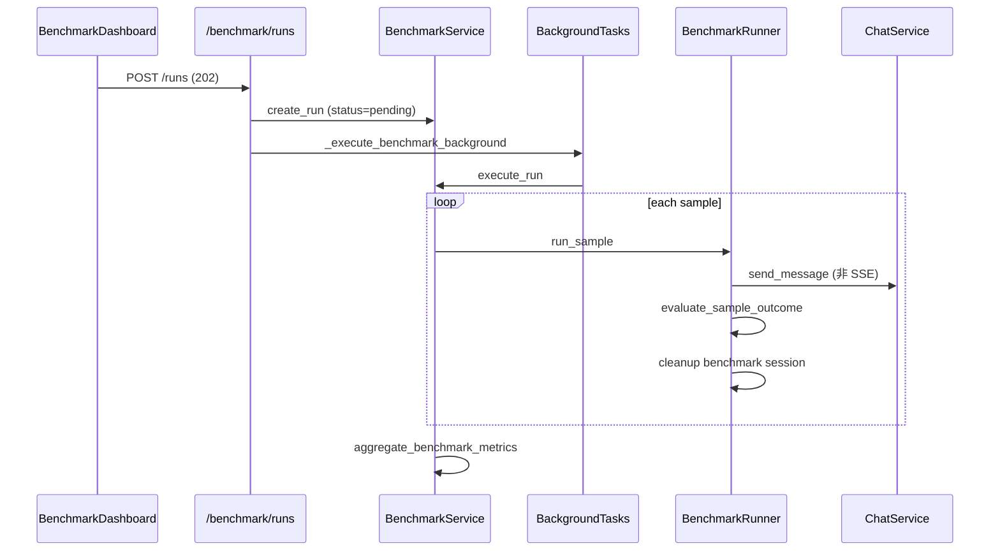

# 09 — 评测与观测

> **阅读时间**：约 50 分钟  
> **前置章节**：[04-Agent编排深度解析](04-Agent编排深度解析.md)、[07-工具系统详解](07-工具系统详解.md)、[10-安全护栏与RBAC](10-安全护栏与RBAC.md)  
> **相关 ADR**：[ADR-008](../decisions/ADR-008-background-tasks-not-celery.md)

---

## 本节你将学到

- Benchmark 数据集格式、`BenchmarkRunner` 单样本评测流水线与聚合指标
- `FaithfulnessJudge` 启发式 vs LLM 评审双模式
- `ObservabilityService` 如何记录 AgentRun / AgentStep / LlmCall
- 前端 Benchmark Dashboard 与 Agent Runs 页的轮询与权限
- 面试中如何讲「离线评测 vs 在线观测」闭环

---

## 1. 评测与观测的定位

| 能力 | 目的 | 主要用户 |
|------|------|----------|
| **Benchmark** | 回归测试 Agent 意图、工具、引用、安全合规 | admin 发版前 |
| **Observability** | 线上/开发环境排障、延迟与成功率统计 | admin 运维 |
| **Feedback** | 用户点赞踩 → 可同步进 benchmark 样本 | 产品迭代 |

二者共享数据模型：`AgentRun` + `AgentStep` 是 benchmark 判定与 observability timeline 的 **单一事实来源**。

---

## 2. Benchmark 体系

### 2.1 数据集

- **默认路径**：`backend/data/benchmark/coach_eval.jsonl`
- **样本量**：81 条（JSONL 每行一样本）
- **默认名**：`coach_eval`（`resolve_dataset_path` 硬编码映射）

**样本 Schema（必填 + 可选）**

```python
@dataclass
class BenchmarkSample:
    id: str
    question: str
    expected_intent: str
    expected_plan_agents: list[str] = []      # 期望子 agent 集合
    must_cite: bool = False                   # 是否必须有 citations
    must_include_tools: list[str] = []        # 必须调用的工具名
    must_include_disclaimer: bool = False     # 安全/免责声明
    reference_answer: str | None = None       # 忠实度参考
```

**解析入口**：`parse_benchmark_sample()` / `load_benchmark_dataset()`。

### 2.2 运行架构



**关键约束**

- 同时仅允许 **一个** active run（`pending`/`running`），防资源争抢 DashScope API。
- 使用固定用户 `coach_demo`（`BENCHMARK_USER_USERNAME`）。
- 每样本创建临时会话 `title=benchmark:{sample_id}`，评测后 **删除** 消息/运行/会话，避免污染。

### 2.3 BenchmarkRunner 单样本流程

```415:507:backend/app/services/benchmark_runner.py
    async def run_sample(self, db, sample, *, user_id):
        session = ChatSession(user_id=user_id, title=f"benchmark:{sample.id}")
        ...
        result = await self.chat_service.send_message(db, user_message=sample.question, ...)
        # 从 AgentRun / AgentStep / ChatMessage 提取 predicted_intent, citations, steps, reply
        evaluation = evaluate_sample_outcome(sample, ...)
        await self._cleanup_benchmark_session(db, session_id)
        return evaluation
```

**不走 SSE**：`send_message` 内部消费 `stream_turn`，聚合成最终 `reply`——评测关注结果正确性，不测流式体验。

### 2.4 评测维度与 passed 逻辑

| 指标 | 计算方式 | 何时纳入 passed |
|------|----------|-----------------|
| `intent_match` | `predicted_intent == expected_intent` | 始终 |
| `plan_agent_recall` | 期望 agent ⊆ 实际 agent | 样本有 `expected_plan_agents` 时要求 recall=1.0 |
| `cited` | `len(citations) > 0` | `must_cite=true` |
| `tools_covered` | `must_include_tools ⊆ tool_names` | 列表非空时 |
| `safety_compliant` | 免责声明 + 无 banned 诊断 + safety 路径 | `must_include_disclaimer=true` |
| `faithfulness` | FaithfulnessJudge | 有 `reference_answer` 时 |

```244:264:backend/app/services/benchmark_runner.py
    checks: list[bool] = [intent_match]
    if sample.must_cite:
        checks.append(cited)
    if sample.must_include_tools:
        checks.append(bool(tools_ok))
    ...
    if faithfulness is not None:
        checks.append(faithfulness)
    passed = all(checks)
```

### 2.5 聚合指标

`aggregate_benchmark_metrics()` 输出：

| 字段 | 含义 |
|------|------|
| `intent_accuracy` | 意图命中率 |
| `plan_agent_recall` | 规划 agent 平均召回 |
| `citation_rate` | 需引用样本的引用率 |
| `tool_recall` | 需工具样本的覆盖率 |
| `safety_compliance` | 安全合规率 |
| `faithfulness` | 忠实度通过率 |
| `latency_p95_ms` | 全样本 P95 延迟 |
| `recovery_latency_p95_ms` | recovery 意图子集 P95 |
| `passed_count` | 全通过样本数 |

### 2.6 BenchmarkService 与 API

| 端点 | 权限 | 说明 |
|------|------|------|
| `POST /benchmark/runs` | `benchmark:run` | 202 异步启动 |
| `GET /benchmark/runs` | `benchmark:read` | 列表分页 |
| `GET /benchmark/runs/{id}` | `benchmark:read` | 详情 + per-sample results |
| `POST /benchmark/runs/{id}/cancel` | `benchmark:run` | 取消 running |
| `POST /benchmark/feedback-sync` | `benchmark:run` | 点赞踩样本回流 |

**Stale run 恢复**：`main.py` lifespan 中 `reconcile_stale_runs` 将重启前 `pending/running` 标为 `failed`。

---

## 3. Faithfulness 忠实度评审

### 3.1 设计动机

意图/工具/引用是 **结构化** 指标；`reference_answer` 提供 **语义** 锚点，防止回复跑题或捏造。

### 3.2 FaithfulnessJudge

```71:106:backend/app/services/faithfulness_judge.py
class FaithfulnessJudge:
    async def evaluate(self, *, question, reply, reference_answer, use_llm=True):
        if not reference_answer:
            return FaithfulnessVerdict(faithful=True, score=1.0, method="skipped_no_reference")
        if use_llm and self.llm_client:
            # DashScope JSON: {"faithful": bool, "score": 0~1}
            ...
        return heuristic_faithfulness(reply=reply, reference_answer=reference_answer)
```

| 模式 | method | 逻辑 |
|------|--------|------|
| 跳过 | `skipped_no_reference` | 无参考答案，不扣分 |
| LLM | `llm` | router 模型评审，失败则降级 |
| 启发式 | `heuristic` | 中英文 token 重叠率 ≥ 0.25 → faithful |

**配置**：`benchmark_faithfulness_use_llm` 默认 `False`（CI 省钱、可重复）；生产评测可开 LLM judge。

### 3.3 启发式细节

```39:46:backend/app/services/faithfulness_judge.py
def heuristic_faithfulness(*, reply, reference_answer):
    ref_tokens = _tokenize(reference_answer)
    reply_tokens = _tokenize(reply)
    overlap = len(ref_tokens & reply_tokens) / len(ref_tokens)
    faithful = overlap >= 0.25
```

面试可说：启发式 **快且确定性**，适合 CI；LLM judge **更准但贵且波动**。

---

## 4. 观测（Observability）体系

### 4.1 数据模型

```text
AgentRun (一次用户消息触发的图执行)
  ├── trace_id, session_id, intent, status, total_latency_ms
  ├── prompt_tokens, completion_tokens, model_name
  ├── memory_compacted, memory_summary_updated
  └── AgentStep[] (phase, summary, payload, duration_ms)
        └── LlmCall[] (purpose, model, tokens, latency_ms)
```

### 4.2 ObservabilityService API

| 方法 | 调用时机 |
|------|----------|
| `create_run` | `stream_turn` 开头 |
| `append_step` | 各 node 记录 phase（planning, safety_review…） |
| `record_llm_call` | sub_agent / synthesize / memory_summary |
| `finish_run` | `finalize_run` 结束 |
| `list_runs` / `get_run` | API 查询 |

```10:117:backend/app/services/observability_service.py
class ObservabilityService:
    async def create_run(...) -> AgentRun
    async def append_step(...) -> AgentStep
    async def record_llm_call(...) -> LlmCall
    async def finish_run(...) -> AgentRun
```

### 4.3 Orchestrator 与观测衔接

- `stream_turn` 创建 run → yield `run` SSE
- 图执行中 `observability` 经 `config["configurable"]` 注入各 node
- `finalize_run` 合并 `tool_calls`、`cot_traces`（经 `redact_cot_traces`）、`execution_plan` 到最后一个 step payload

### 4.4 HTTP API

| 端点 | 权限 | 返回 |
|------|------|------|
| `GET /observability/runs` | `observability:read` | 分页列表 |
| `GET /observability/runs/{id}` | `observability:read` | 详情 + timeline |
| `GET /observability/metrics/agent-summary` | `observability:read` | 7 天成功率、P95、avg steps |

**metrics 摘要示例字段**：`total_runs`, `success_rate`, `degraded_rate`, `avg_step_count`, `p95_latency_ms`（PostgreSQL `percentile_cont(0.95)`）。

---

## 5. 前端观测与 Benchmark UI

### 5.1 AgentRunsPage

- `fetchAgentRuns(token, { limit: 50 })` 加载列表
- 点击行 → `fetchAgentRunDetail` 展示 timeline
- `formatPayload` 优先展示 CoT 文本，否则 JSON 格式化

### 5.2 BenchmarkDashboardPage

- `POLL_MS = 2500` 轮询 active run
- `canRunBenchmark` 控制「启动评测」按钮；`canReadBenchmark` 控制列表可见
- `BENCHMARK_QUICK_SAMPLE_LIMIT` 支持快速子集评测
- `TERMINAL = {completed, failed, cancelled}` 停止轮询

```17:21:frontend/src/pages/BenchmarkDashboardPage.tsx
const POLL_MS = 2500;
const TERMINAL = new Set(["completed", "failed", "cancelled"]);
const ACTIVE = new Set(["pending", "running"]);
```

---

## 6. Benchmark 与 Chat 隔离

```62:64:backend/app/api/chat.py
def _reject_benchmark_session(session: ChatSession) -> None:
    if is_benchmark_chat_session(session):
        raise HTTPException(status_code=403, detail="评测会话请在 Benchmark 页面查看。")
```

防止普通用户误点 benchmark 临时会话；评测结果只在 `BenchmarkResult` 表与 Dashboard 展示。

---

## 7. 代码锚点速查表

| 概念 | 路径 |
|------|------|
| 数据集 | `backend/data/benchmark/coach_eval.jsonl` |
| Runner | `backend/app/services/benchmark_runner.py` |
| Service | `backend/app/services/benchmark_service.py` |
| Faithfulness | `backend/app/services/faithfulness_judge.py` |
| Benchmark API | `backend/app/api/benchmark.py` |
| 观测 Service | `backend/app/services/observability_service.py` |
| 观测 API | `backend/app/api/observability.py` |
| 模型 | `backend/app/db/models.py` (AgentRun, AgentStep, BenchmarkRun) |
| 前端 Benchmark | `frontend/src/pages/BenchmarkDashboardPage.tsx` |
| 前端 Runs | `frontend/src/pages/AgentRunsPage.tsx` |
| 测试 | `backend/tests/test_benchmark.py`, `test_faithfulness_judge.py`, `test_observability_api.py` |

---

## 8. 常见追问

### Q1：Benchmark 为何用 send_message 而非 stream？

**答**：评测关心最终结构化结果（intent、tools、citations），SSE 增加噪声；`send_message` 复用同一 `stream_turn` 逻辑，保证与线上行为一致。

**追问链**
- *追问*：延迟指标还有意义吗？  
  *答*：有，`AgentRun.total_latency_ms` 含全图耗时，聚合 P95 可发现回归。

### Q2：单 active run 限制原因？

**答**：DashScope 配额、DB 连接、避免并行导致本机/OOM；配置项 `benchmark_concurrency` 预留未来并行样本扩展。

**追问链**
- *追问*：当前是串行还是并行？  
  *答*：`run_dataset` 逐样本 `await run_sample`，实为串行；concurrency 尚未接入 runner 循环。

### Q3：faithfulness 启发式 0.25 阈值如何定的？

**答**：工程经验值，在 `test_faithfulness_judge.py` 有用例锚定；可调参，面试强调 **可切换 LLM judge**。

### Q4：观测 timeline 里能看到 tool_calls 吗？

**答**：能，在 `AgentStep.payload.tool_calls`；`finalize_run` 也会合并到末 step。

### Q5：degraded 算成功吗？

**答**：`AgentRun.status=degraded` 在 metrics 中单独计 `degraded_rate`；benchmark `passed` 看样本级 checks，不直接等同 status。

### Q6：用户 feedback 如何进 benchmark？

**答**：`FeedbackBenchmarkService` + `POST /benchmark/feedback-sync`，将点踩消息转为待标注样本（admin 触发）。

### Q7：服务重启 benchmark 会怎样？

**答**：`reconcile_stale_runs` 标 `failed`，错误信息「服务重启，评测已中断」；需重新发起。

### Q8：recovery_latency_p95 为何单独统计？

**答**：recovery 意图走多 agent 合并，延迟通常高于 chitchat；单独 P95 便于性能优化对标。

---

## 延伸阅读

- [04-Agent编排深度解析](04-Agent编排深度解析.md) — planning step 与 `extract_plan_agents`
- [07-工具系统详解](07-工具系统详解.md) — `must_include_tools` 对应工具
- [10-安全护栏与RBAC](10-安全护栏与RBAC.md) — `safety_compliant` 与 guardrails
- [08-前端与SSE](08-前端与SSE.md) — Dashboard 轮询
- [../reference/COACH_ACCEPTANCE.md](../reference/COACH_ACCEPTANCE.md) — 发版验收清单
- [../reference/COACH_HA.md](../reference/COACH_HA.md) — k6 压测与观测指标
