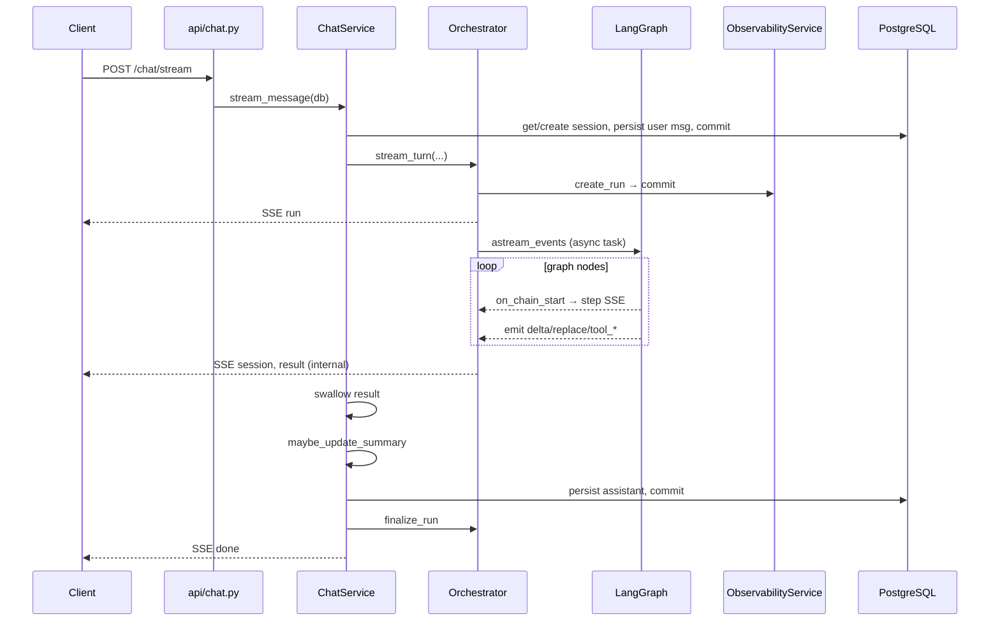

# 11 — 代码导读：后端关键路径

> **阅读时间**：约 55 分钟（边读边跳转代码）  
> **前置章节**：guide/01–10 任选；建议先读 [03-系统架构与分层](03-系统架构与分层.md)、[04-Agent编排深度解析](04-Agent编排深度解析.md)  
> **相关 ADR**：[decisions/INDEX.md](../decisions/INDEX.md)

---

## 本节你将学到

- 后端 **推荐阅读顺序**（自顶向下 vs 自底向上两条路径）
- 从 `POST /chat/stream` 到 DB 入库的 **完整生命周期**（逐步对照文件）
- `backend/app/` 目录职责地图
- **测试地图**：49 个测试文件按域分类，知道改哪跑哪
- 面试「带我走一遍请求链路」的 3 分钟 / 8 分钟话术

---

## 1. 后端目录地图

```text
backend/app/
├── main.py                 # FastAPI 入口、路由挂载、seed lifespan
├── api/                    # HTTP 层：auth, chat, knowledge, observability, benchmark, profile
├── core/                   # config, deps, errors, middleware, rate_limit, trace
├── auth/                   # JWT, permissions, password
├── agent/
│   ├── coach/              # LangGraph：graph, state, orchestrator, nodes/*
│   ├── tools/              # 7 工具 + registry
│   ├── guardrails.py
│   └── intent_router.py
├── services/               # 业务服务：chat, rag, memory, benchmark, observability...
├── llm/                    # DashScope 客户端、tool_call_buffer
├── db/                     # models, session, seed_*
├── schemas/                # Pydantic 请求/响应
└── prompts/                # system prompt 模板
```

**分层规则**：`api` 薄路由 → `services` 编排 → `agent` 图执行 → `db` 持久化。避免在 `api` 写业务逻辑。

---

## 2. 推荐阅读顺序

### 路径 A — 自顶向下（面试讲链路首选）

| 序号 | 文件 | 关注点 |
|:----:|------|--------|
| 1 | `main.py` | 路由表、中间件、seed |
| 2 | `api/chat.py` | `/stream` StreamingResponse |
| 3 | `services/chat_service.py` | 七步契约、`_complete_turn_events` |
| 4 | `agent/coach/orchestrator.py` | `stream_turn`、queue+graph_task |
| 5 | `agent/coach/graph.py` | 节点边表 |
| 6 | `agent/coach/state.py` | CoachState 字段 |
| 7 | `agent/coach/nodes/route_intent.py` | 意图 |
| 8 | `agent/coach/nodes/plan_execute.py` | 计划 |
| 9 | `agent/coach/nodes/sub_agent.py` | ReAct+工具 |
| 10 | `agent/coach/nodes/synthesize.py` | 合并+delta/replace |
| 11 | `agent/coach/nodes/apply_guardrails.py` | 护栏 |
| 12 | `agent/coach/nodes/persist_turn.py` | 状态收尾 |
| 13 | `services/memory_service.py` | 摘要更新 |
| 14 | `services/observability_service.py` | run/step 落库 |

### 路径 B — 自底向上（深入单模块）

| 模块 | 起点文件 | 延伸 |
|------|----------|------|
| RAG | `services/rag_service.py` | `api/knowledge.py`, `services/ingest_service.py` |
| 工具 | `agent/tools/registry.py` | `tools/*.py`, `nodes/sub_agent.py` |
| 安全 | `agent/guardrails.py` | `nodes/safety_review.py`, `nodes/apply_guardrails.py` |
| 认证 | `auth/tokens.py` | `api/auth.py`, `core/deps.py` |
| 评测 | `services/benchmark_runner.py` | `api/benchmark.py`, `services/benchmark_service.py` |

---

## 3. Chat Stream 全生命周期

### 3.1 时序总览



### 3.2 逐步对照

#### Step 0 — HTTP 入口

```232:269:backend/app/api/chat.py
@router.post("/stream")
async def stream_chat(...):
    _enforce_chat_stream_rate_limit(...)
    _reject_benchmark_session(...)  # 若已有 session_id
    async def event_generator():
        async with AsyncSessionLocal() as db:
            async for event in service.stream_message(db, ...):
                yield f"data: {dumps(event)}\n\n"
    return StreamingResponse(event_generator(), media_type="text/event-stream", ...)
```

**注意**：流式请求使用 **独立** `AsyncSessionLocal()`，与依赖注入的 `get_db` 生命周期分离，防止 session 提前关闭。

#### Step 1 — ChatService 持久化用户消息

```197:213:backend/app/services/chat_service.py
async def stream_message(...):
    session = await self._get_or_create_session(db, session_id, user_id)
    user_record = await self._persist_user_message(db, session, user_message)
    await db.commit()
```

- 新会话：`session_id=None` → 创建 `ChatSession`，首条消息前 40 字作 title
- `memory_service.validate_user_message_length` 超长抛 `ValueError` → yield error

#### Step 2 — Orchestrator stream_turn

```163:282:backend/app/agent/coach/orchestrator.py
    run = await self.observability.create_run(...)
    yield {"type": "run", "run_id", "trace_id"}
    queue = asyncio.Queue()
    graph_task = asyncio.create_task(run_graph())
    while True:
        item = await queue.get()  # 带超时轮询
        yield item  # step, tool_call, delta, replace, ...
    yield {"type": "session", "session_id", "citations"}
    yield result.to_result_event()  # type=result
```

**并发模型**：LangGraph 在 `graph_task` 跑；节点经 `emit` 往 `queue` 塞 SSE 事件；主协程消费 queue 转发——解耦图执行与流式背压。

#### Step 3 — LangGraph 执行

```20:52:backend/app/agent/coach/graph.py
START → load_profile → route_intent → plan_execute
  → [coach_chitchat | knowledge_prefetch | sub_agent | serial_dispatch]
  → safety_review → synthesize → apply_guardrails → persist_turn → END
```

`config["configurable"]` 注入：`db`, `llm`, `tool_registry`, `observability`, `guardrails`, `emit`, `run_meta`。

#### Step 4 — ChatService 吞 result、完成回合

```215:236:backend/app/services/chat_service.py
        async for event in self.orchestrator.stream_turn(...):
            if event.get("type") == "result":
                result = self._coach_result_from_event(event)
                continue  # 不转发客户端
            yield event
        async for event in self._complete_turn_events(db, session=session, result=result):
            yield event
```

#### Step 5 — _complete_turn_events（唯一 done 来源）

| 子步 | 动作 |
|------|------|
| 5a | `memory_service.maybe_update_summary`（older 对；早于 assistant 入库） |
| 5b | INSERT `ChatMessage` assistant，`retrieved_chunks={"items": citations}` + `commit` |
| 5c | 可选 yield `step` phase=`memory_summary` |
| 5d | `orchestrator.finalize_run` → 更新 `AgentRun`、合并 step payload |
| 5e | yield `done` 含 `assistant_message_id` |

### 3.3 与 /chat/send 的差异

`send_message` 同样调 `stream_turn`，但：

- 聚合 `delta`/`replace` 为 `reply` 字符串返回 JSON
- 不向前端推 SSE
- Benchmark runner 使用此路径

---

## 4. 其他关键 API 路径（简表）

| 路由前缀 | 文件 | 核心 Service |
|----------|------|--------------|
| `/auth` | `api/auth.py` | tokens, permissions |
| `/chat` | `api/chat.py` | ChatService, ChatSessionService |
| `/knowledge` | `api/knowledge.py` | IngestService, RagService |
| `/profile` | `api/profile.py` | ProfileService |
| `/observability` | `api/observability.py` | ObservabilityService |
| `/benchmark` | `api/benchmark.py` | BenchmarkService |

---

## 5. 配置与环境

**单一真相**：`core/config.py` `Settings`（pydantic-settings，读 `.env`）。

面试常问项：

| 变量 | 默认 | 影响 |
|------|------|------|
| `DASHSCOPE_API_KEY` | — | LLM/embedding |
| `AUTH_SECRET_KEY` | — | JWT |
| `GRAPH_RAG_ENABLED` | true | graph_lookup 工具 |
| `LONG_CONTEXT_MODE` | summary | 记忆模式 |
| `AGENT_ENABLE_THINKING_STEPS` | true | step/tool SSE |
| `BENCHMARK_FAITHFULNESS_USE_LLM` | false | 忠实度评审 |

---

## 6. 测试地图（49 files）

### 6.1 按域分类

| 域 | 测试文件 | 覆盖点 |
|----|----------|--------|
| **Agent 图** | `test_coach_graph.py`, `test_graph.py`, `test_plan_execute.py`, `test_recovery_serial_fallback.py`, `test_parallel_recovery.py` | 路由、并行、recovery |
| **子 Agent** | `test_sub_agent_react.py`, `test_build_llm_messages.py`, `test_cot_parse.py` | ReAct、CoT |
| **意图** | `test_intent.py` | route_intent |
| **工具** | `test_coach_tools.py`, `test_registry.py`, `test_tool_sse_gating.py` | 7 工具、SSE 门控 |
| **RAG** | `test_rag.py`, `test_ingest.py`, `test_graph_context.py`, `test_seed_knowledge.py` | 检索、入库 |
| **记忆** | `test_memory.py`, `test_long_context_mode.py` | 摘要、full 模式 |
| **护栏** | `test_guardrails.py`, `test_apply_guardrails_node.py`, `test_safety_review.py`, `test_safety_turn.py` | 安全 |
| **Chat** | `test_chat_stream.py`, `test_chat_sessions.py`, `test_sse_bridge.py`, `test_message_feedback.py` | SSE、会话 |
| **Auth** | `test_auth.py`, `test_login_lockout.py`, `test_rate_limit.py`, `test_seed_users.py` | JWT、锁定 |
| **Benchmark** | `test_benchmark.py`, `test_benchmark_api.py`, `test_feedback_benchmark.py`, `test_faithfulness_judge.py` | 评测 |
| **观测** | `test_observability_api.py`, `test_obs_svc.py`, `test_metrics.py` | timeline、指标 |
| **基础设施** | `test_health.py`, `test_dashscope.py`, `test_degraded.py`, `test_resilience.py`, `test_models_import.py` | 健康、降级 |
| **其他** | `test_profile.py`, `test_knowledge_api.py`, `test_token_usage.py`, `test_planning_step_count.py` | 画像、知识 API |

### 6.2 改代码后跑哪些测试？

| 你改了… | 建议至少跑 |
|---------|-----------|
| `agent/coach/graph.py` 或 nodes | `pytest tests/test_coach_graph.py tests/test_graph.py -q` |
| `agent/tools/*` | `pytest tests/test_coach_tools.py tests/test_registry.py -q` |
| `guardrails.py` | `pytest tests/test_guardrails.py tests/test_apply_guardrails_node.py -q` |
| `chat_service.py` / `api/chat.py` | `pytest tests/test_chat_stream.py tests/test_sse_bridge.py -q` |
| `auth/*` | `pytest tests/test_auth.py -q` |
| `benchmark_runner.py` | `pytest tests/test_benchmark.py tests/test_faithfulness_judge.py -q` |
| `rag_service.py` | `pytest tests/test_rag.py -q` |

**全量**：`cd backend && pytest -q`（README 验收命令）。

### 6.3 conftest 与 mock

- `tests/conftest.py` — 异步 DB fixture、测试 client
- `tests/coach_mocks.py` — 图执行 mock LLM

---

## 7. 面试话术模板

### 3 分钟版

> 用户 POST `/chat/stream` 带 JWT → `ChatService` 建会话、存 user 消息 → `CoachGraphOrchestrator.stream_turn` 创建 `AgentRun` 并跑 LangGraph：意图→计划→并行 sub_agent（ReAct 调 7 工具）→ 安全审查 → 合成 → 护栏 → 持久化 state → 流式 SSE step/delta/replace → `ChatService` 存 assistant、`finalize_run`、更新记忆摘要 → `done`。全程 `ObservabilityService` 记 step 与 token。

### 8 分钟版（加细节）

在 3 分钟基础上补充：

1. **并行**：`plan_execute` 后 `route_after_plan_execute` 可走 `sub_agent` Send 并行或 `serial_dispatch` recovery 串行
2. **SSE**：`result` 事件仅内部；`done` 唯一由 ChatService 发；护栏改写发 `replace`
3. **RAG**：`use_rag` 控制；Citation Guard 在低分检索时 fallback
4. **RBAC**：`require_permissions("chat:send")`；会话 own/all 检查
5. **评测**：同链路走 `send_message` 离线跑 81 样本

---

## 8. 代码锚点速查表

| 场景 | 入口文件 |
|------|----------|
| 启动 | `main.py` |
| 流式聊天 | `api/chat.py` → `services/chat_service.py` |
| 图编排 | `agent/coach/orchestrator.py` |
| 图定义 | `agent/coach/graph.py` |
| 状态 | `agent/coach/state.py` |
| LLM | `llm/dashscope_client.py` |
| 配置 | `core/config.py` |
| 依赖注入 | `core/deps.py` |
| ORM | `db/models.py` |
| 测试入口 | `tests/conftest.py` |

---

## 9. 常见追问

### Q1：为何 Orchestrator 用 queue 而不是直接 yield from graph？

**答**：`astream_events` 与 `emit` 回调在不同协程；queue 统一出站顺序，且可在图结束后补 `session`/`result` 事件。

**追问链**
- *追问*：queue 会丢事件吗？  
  *答*：graph 异常时 put SENTINEL 结束消费；未捕获异常走 `error` SSE 并 `finish_run(failed)`。

### Q2：stream 为何单独开 AsyncSession？

**答**：FastAPI 依赖注入的 session 在 generator 迭代间可能失效；长连接流式需要持有 session 直至 `finalize_run` 完成。

### Q3：节点里如何访问 DB？

**答**：`config["configurable"]["db"]`，与 ChatService 传入同一 session，保证 assistant 与 run 同事务域（多次 commit 分界清晰）。

### Q4：如何本地调试图而不调 DashScope？

**答**：测试用 `coach_mocks`；开发可设 mock client 或跑 `pytest` 集成测试；无内置 UI debug 面板，靠 Agent Runs timeline。

### Q5：LangGraph 版本升级注意什么？

**答**：`astream_events(..., version="v2")` 与 `on_chain_start` 过滤逻辑绑定；升级需回归 `test_coach_graph.py`。

### Q6：degraded status 在哪设？

**答**：`sub_agent` 工具步数耗尽、`orchestrator._build_result` 空答案等路径写 `state.status=degraded`；仍产出 fallback 模板答案。

### Q7：token 用量存在哪？

**答**：`AgentRun.prompt_tokens/completion_tokens`；细粒度在 `LlmCall` 表；`track_llm_usage` 各 node 调用。

### Q8：如何扩展新 API 路由？

**答**：`api/` 新建 router → `main.py` `include_router` → `schemas/` 定义模型 → 测试仿 `test_knowledge_api.py`。

---

## 延伸阅读

- [04-Agent编排深度解析](04-Agent编排深度解析.md) — 节点逐一讲解
- [08-前端与SSE](08-前端与SSE.md) — 客户端消费
- [09-评测与观测](09-评测与观测.md) — AgentRun 字段含义
- [../reference/AGENT_SSE.md](../reference/AGENT_SSE.md) — 事件契约
- [../reference/ARCHITECTURE.md](../reference/ARCHITECTURE.md) — 分层图
- [../specs/COACH_AGENT_REDESIGN.md](../specs/COACH_AGENT_REDESIGN.md) — §3.5 ChatService 回合契约（注意：spec 中摘要顺序可能滞后于当前实现，以 `chat_service._complete_turn_events` 为准）
